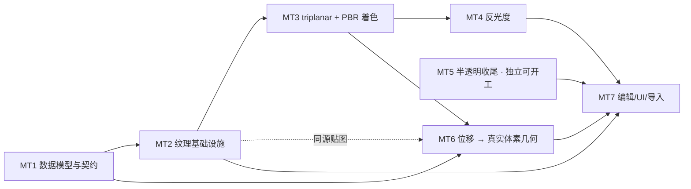

# GATE 材质系统与 PBR · 全局计划

## 0. 目标

把 gate 的材质从「per-material 纯色 + 三个标量」升级到
[Douglas #22](douglas/transcripts/Grass,%20textures,%20and%20a%20new%20codebase%20%5BVoxel%20Devlog%20%2322%5D%20%5BYTZBFz3Et40%5D.en.txt) 的模型：

```
voxel（材质标签） → 材质表（palette 槽） → 材质资产（PBR 贴图集）
                                          ↓ 上传/编辑时 bake
                                     逐体素法线 + 纹理参数（缓存）
```

**本次覆盖的四项**

| 项 | 现状 | 本计划中的位置 |
|---|---|---|
| 自发光 | ✅ 已完成 | 并入 MT3 的统一着色模型 |
| 半透明（吸收式透明） | 🟡 主 pass 有，GI 侧不参与 | MT5 |
| 反光度（镜面反射） | ❌ 未开始 | MT4 |
| PBR 材质（贴图集 + BRDF + **位移几何**） | ❌ 未开始 | MT1 / MT2 / MT3 / MT6 |

**非目标**（Douglas #22 的另一半，另立计划）

- 草/叶 decorations（aux buffer + 光栅化合成）
- volumetrics（光轴）
- 显式 per-voxel 法线**存储**（Douglas 已改隐式，gate 现状一致，不回退）
- **法线贴图造假凹凸**：凹凸改走 MT6 的**真实体素几何**（见 D2）

---

## 1. 现状取证

### 1.1 对照 Douglas #22

| Douglas #22 | gate 现状 | 证据 |
|---|---|---|
| 体素只存材质标签 | ✅ 16-bit palette index，65536 槽 | `PALETTE_BITS = 16`（[palette.rs](../gate-voxel/src/palette.rs)） |
| 材质参数在表里 | ✅ `color / roughness / emissive / transmission / flags` 8B | [palette.rs#L95-L111](../gate-voxel/src/palette.rs#L95-L111) |
| per-voxel 法线**隐式** | ✅ 运行时算，不存储 | `voxel_normal`（[world.wesl](../assets/shaders/voxel_raytrace/world.wesl)） |
| 上传时 bake + 缓存 | ❌ 无 bake pass、无缓存；法线每像素重算 —— **本计划决定不做**（凹凸改走真实几何，见 D2） | [main.wesl#L249-L261](../assets/shaders/voxel_raytrace/main.wesl#L249-L261) |
| 纹理 + triplanar mapping | ❌ 完全没有纹理，只有 per-material 纯色 | [common.wesl `palette_albedo`](../assets/shaders/voxel_raytrace/common.wesl#L74-L82) |
| **CSG 表面位移**（bumpy bricks） | ❌ `fill_box` / `fill_bricks` / `fill_sphere` 均无位移参数 | [gate-voxel/src/scene.rs](../gate-voxel/src/scene.rs) |
| PBR 贴图集（albedo / **height** / rough-metal） | ❌ | 无 `assets/textures/` 目录 |
| 吸收式透明 | 🟡 `transmission` + `MediumRay` 乘性 tint；但 GI 侧把 transmissive 像素整格判废 | [trace.wesl#L32-L50](../assets/shaders/voxel_raytrace/trace.wesl#L32-L50)、[screen.wesl#L231](../assets/shaders/voxel_raytrace/gi/screen.wesl#L231) |
| 自发光 | ✅ | [gi/ray.wesl#L82](../assets/shaders/voxel_raytrace/gi/ray.wesl#L82) |

### 1.2 关键结论

**"三种属性互斥 / 共用字段 + 标志位" 这个前提不成立，且不需要。**

- 物理上它们是 BSDF 的**独立参数**，不是互斥的材质类型：玻璃 = transmission + 光滑，磨砂玻璃 = transmission + 粗糙，LED 外壳 = emissive + transmission，金属 = metallic + 粗糙。
- 代码现状**已经是独立字段并存**：`PaletteEntry` 里三个属性各占一个字节，shader 侧各自独立解包、独立作用，且玻璃状态机本身就在同时使用 transmission 与（硬编码的）Fresnel 反射。
- 互斥枚举无法表达 metallic-roughness 的连续参数空间 ⇒ **它才是与 PBR 冲突的那一方**。
- 因此本计划**不为"互斥"做任何数据模型改动**。

**代码现状里唯一"互斥"的是着色分派**（`transmission > 0` → 玻璃状态机，否则 → 不透明着色），这是**读同一组参数后选代码路径**，与参数是否互斥无关，可以保留。

---

## 2. 硬约束（改动前必读）

1. **跨语言常量的权威在 WESL 源码**：`gate-render/src/wesl_consts.rs` 启动时解析 WESL 包的常量，Rust 侧不留副本，不一致即 fail-fast。新增材质常量必须写进 `.wesl`。
2. **GI 复用判据不可绕过**：ReSTIR 的样本等价 = **精确几何面键 + 二次顶点键逐位相等**（[gi/consts.wesl 文件头](../assets/shaders/voxel_raytrace/gi/consts.wesl#L18-L27)）。这是薄板/墙缝不漏光的根本。新特性（尤其 MT4 的粗糙反射）不得让不同方向的样本被判定为"等价"。
3. **着色口径不分叉**：`main.wesl` 的不透明分支与 `gi/ray.wesl` 的二次顶点辐亮度必须**逐项对齐**（含 1/π）。改一处必须同改另一处。
4. **bind group 必须从索引 0 起成前缀设置**（[README §5.6](../README.md)）。
5. **上传走增量**：`DirtyRanges { struct_ranges, palette_range }`（[builder.rs#L73-L79](../gate-render/src/brickmap/builder.rs#L73-L79)）。新增 GPU 资源必须有自己的增量路径，或写明"只能全量"的理由与代价。
6. **palette 布局改动三处同步**：`wire.rs::pack_palette_entry`（写） / `common.wesl` 三个解包函数（读） / `trace.wesl::medium_of`（介质读）；新增 `flags` 语义位时还要加上写入侧维护（见 MT1-2）。
7. **`PaletteEntry` 8B 按变体复用**（D1）：`flags` 的 bit4..7 是空闲位，`IS_PBR`（bit4）与 `TRANSMISSIVE`（bit5）占用后只剩 bit6..7；新增语义位前须复核。
8. **`gate-voxel` 零渲染依赖**（依赖仅 glam + rayon）：MT6 的位移高度场必须是**普通 CPU 数据**，不能把 GPU 纹理 / 渲染类型带进纯逻辑 crate。
9. **F0 只有一个来源**（D1「F0 的唯一来源规则」）：`IOR`（资产级，物理基值）+ `specular 覆盖`（槽级，仅调制）—— 不得再出现第三处 F0 编码（现存 `GLASS_IOR` / `GLASS_F0` 两份硬编码须随之删除）。

---

## 3. 关键设计决策（开工前需签字）

### D1 · palette 槽与材质资产：**8B 变体复用（tagged union）** —— 已定稿

**核心洞察（2026-09-20，用户提出）**：`PaletteEntry` 现有的 `color / roughness / emissive / transmission`
**本来就是 PBR 参数的子集**（PBR = albedo + roughness + metalness + emissive + transmission + IOR + …），
两者是**重叠**关系、不是并列关系。所以不需要扩字段，而是让这 8B **按 flag 复用为两种变体**：

| | `IS_PBR = 0` · **平凡材质** | `IS_PBR = 1` · **PBR 材质** |
|---|---|---|
| 语义 | 现在这套：逐 volume 独立参数 | 引用全局材质资产（PBR 贴图集）+ 标量覆盖 |
| payload | `color[3]` + `roughness` + `emissive` + `transmission` + `metallic` | `asset: u16`（65536 个资产）+ 4 个标量覆盖 |
| 共享头 | `flags`（两变体都有） | 同左 |

#### 属性清单的去留（回答 PBR 属性表）

| 属性 | 进 palette？ | 结论 |
|---|---|---|
| 颜色 albedo | ✅ 3B | 平凡变体的 `color`；PBR 变体由资产提供（不做逐实例染色） |
| 透明 transmission | ✅ 1B | |
| 粗糙 roughness | ✅ 1B | |
| 发光 emissive | ✅ 1B | |
| **金属度 metallic** | ✅ 1B | 落在**一直没用的 `_pad` 字节**上；默认 0 = 非金属 = 现状观感 ⇒ 零回归。**保持 8 bit、不切 1 bit** —— 手工调参下 metallic 确实几乎总是 0/1，但在**贴图驱动**下（D3 = B）它来自 rough-metal 贴图的 B 通道，是 **8 bit 连续量**（磨损边缘 / 锈迹 / 脏污的过渡）；palette 这 1B 是"无贴图时的回退值"，8 bit 是 glTF/UE 的标准做法 |
| **高光度 specular** | ✅ 1B（仅 PBR 变体） | **不新增字节、不切 metallic**：对非金属 `F0 = ((IOR−1)/(IOR+1))²` —— **"高光度"与"折射率"是同一物理量的两种编码**（IOR 1.5 → F0 0.04，正是"默认 0.5 ≈ 4%"；IOR 1.33 水 → 0.02；IOR 2.4 钻石 → 0.17）。gate 现在已有两份硬编码描述同一件事：`GLASS_IOR = 1.5` 与 `GLASS_F0 = 0.04`（[main.wesl#L41-L44](../assets/shaders/voxel_raytrace/main.wesl#L41-L44)）。**定稿方案**：① **IOR 提升为材质资产参数**（同时服务玻璃折射与电介质 F0，顺手消掉那两份硬编码）；② 逐槽调节走 **PBR 变体空着的 1B**（word1 bit24..31）作 `specular 覆盖`，语义同 glTF `KHR_materials_specular`（只调制电介质 F0，**对金属无效**）⇒ 资产级给物理基值、槽级给调节量，两者不重复 |
| **法线 normal** | ❌ 不存 | 法线是**几何的函数、不是材质的输入**：MT6 位移产出真实体素后，`voxel_normal` 从邻域梯度隐式给出（现状已如此，Douglas 亦为隐式）。⇒ palette 不存，**资产里也不要 normal 层** |
| **高度 height** | ❌ 不进 palette | 高度是**位移的输入**，只在体素化那一刻被采样一次；位移产物就是普通体素 ⇒ 只存在于**材质资产**（MT6 的输入），不进 palette、不进体素数据 |
| **AO** | ❌ 不需要 | 标准 PBR 的 AO 是 **AO 贴图**（材质表面的**微观**遮挡）；gate 已有的 `light_field_ao` 是**场景尺度**遮蔽，两回事。但在"凹凸 = 真实体素几何"的前提下，**凹槽真是凹的，GI 会自然把里面照暗**（Douglas 截图里凹槽发暗正是这个机制）；比一个体素更细的"微观遮挡"在体素引擎里无几何意义 ⇒ 不存 AO、不要 AO 贴图，省下的字节正好给 metallic |

⇒ 属性表里 8 项，实际进 palette 的是 **6 项**（color 3B + transmission + roughness + emissive + metallic = **7B**）+ `flags` 1B = **8B，正好填满**。

#### 字节布局（定稿）

**平凡变体 `IS_PBR = 0`（= 现状 + metallic，逐位向后兼容）**

| word | bits | 内容 |
|---|---|---|
| word0 | 0..23 | `color.r/g/b`（sRGB，各 8 bit） |
| word0 | 24..31 | `roughness` |
| word1 | 0..7 | `emissive` |
| word1 | 8..15 | `transmission` |
| word1 | 16..23 | `flags` |
| word1 | 24..31 | **`metallic`**（原 `_pad`，由"废弃"变为"有语义"） |

**PBR 变体 `IS_PBR = 1`（资产引用 + 标量覆盖）**

| word | bits | 内容 |
|---|---|---|
| word0 | 0..7 | `roughness` 覆盖 |
| word0 | 8..15 | `metallic` 覆盖 |
| word0 | 16..23 | `emissive` 覆盖 |
| word0 | 24..31 | `transmission` 覆盖 |
| word1 | 0..15 | **`asset: u16`** |
| word1 | 16..23 | `flags` |
| word1 | 24..31 | **`specular` 覆盖**（语义同 glTF `KHR_materials_specular`） |

- **覆盖语义**：`0 = 不覆盖（用资产的值）`，`1..255 = 覆盖为 (v−1)/254`（这样 `1` 能表达 roughness = 0 的完全镜面）。
- 相比最初提的"asset + rough/emit/trans 三个覆盖"，这里补上了 `metallic` 覆盖（word0 那 4 个字节本来就全空），
  且 `word1 bit24..31` 由"保留"改为 **`specular` 覆盖** ⇒ PBR 变体 7B payload 全部用满。
- **布局原则**：平凡变体的字节位置被"向后兼容"钉死、一格不能动；**PBR 变体的位置完全自由**（故按最省的方式排）。

#### **F0 的唯一来源规则**（消歧，防止出现第三份编码）

| 情形 | 规则 |
|---|---|
| 金属（`metallic = 1`） | `F0 = albedo`（绝缘体无漫反射，base color 即镜面色） |
| 非金属（`metallic = 0`） | `F0 = ((IOR−1)/(IOR+1))²`，`IOR` 来自**材质资产**；平凡变体固定 IOR = 1.5（⇒ F0 = 0.04 = **现状**） |
| 逐槽调节 | `specular 覆盖` 仅**调制**电介质 F0（乘性），**对金属无效** |
| 过渡（`metallic ∈ (0,1)`） | 两条 F0 按 metallic 线性混合（与 BRDF 的 metallic 混合同一个权重） |

⇒ `IOR` 是**物理基值**（资产级，同时服务玻璃折射与 F0）；`specular 覆盖` 是**逐实例调节**（槽级）。
两者职责不同、**不重复**。`GLASS_IOR` / `GLASS_F0` 两份硬编码随之删除（改为读资产 IOR + 上式导出）。

#### `flags` 位分配

| bit | 语义 |
|---|---|
| 0..3 | `LOCKED` / `INPUT_PORT` / `OUTPUT_PORT` / `HOLOGRAM`（现有，不动） |
| 4 | **`IS_PBR`**（变体位） |
| 5 | **`TRANSMISSIVE`**（DDA 热路径位，写入侧维护） |
| 6..7 | 保留 |

**为什么优于「扩到 16B」与「三属性互斥」**：

1. **向后兼容到零回归**：`IS_PBR` 只占 `flags` 的 **bit4**（当前空闲），平凡变体的字节布局与今天**逐位相同**
   ⇒ 现有解包函数、`medium_of`、UI 三个滑杆、`.vox` 导入**全部不用改**。
2. **不需要压精度**：平凡变体保留 8 bit 的 roughness / emissive / transmission。
3. **不需要三属性互斥**：平凡材质里三者照旧并存；互斥会丢掉的表达力（岩浆岩 = 粗糙岩石 + 裂缝发光）
   改由 PBR 变体承担（emission 贴图与 rough-metal 贴图并存）。
4. **资产上限 65536**，远超实际需要。

**必须遵守的三条（否则方案失效）**：

1. **着色公式唯一**：flag 只决定「参数从哪来」，**不决定走哪条着色路径**。全局只能有**一个** PBR BRDF 求值函数，
   平凡材质 = 「参数内联」的 PBR 材质（metallic 取 0、无贴图）。做成两条着色路径即违反硬约束 3。
2. **DDA 热路径必须只看 flags 位**：`medium_of`（[trace.wesl](../assets/shaders/voxel_raytrace/trace.wesl#L32-L39)）
   在 DDA 内**逐体素**调用；PBR 变体里 `transmission` 所在字节已被 `asset` 占用 ⇒ 透射判定改读
   `flags` 的 **`TRANSMISSIVE` 位（bit5；同一个 word1，零额外读取）**，该位由**写入侧**
   （`wire.rs::pack_palette_entry`）维护：平凡变体 = `transmission > 0`，PBR 变体 = 资产标了透射。
3. **flags 新位三处同步**：`wire.rs` / shader 解包 / UI 写入。

**已知代价**：

- 命中后着色多一级间接（palette → 全局资产表）；只发生在**命中点**、不是逐体素 ⇒ 可接受。
- `flags` 的 bit4/5/6 从「空闲」变为「有语义」，后续再加位需复核三者。

#### 核实取证（条目当前 8B，不是 16B）

| 事实 | 值 | 出处 |
|---|---|---|
| 材质索引位宽 | **16 bit**（不是字节） | `PALETTE_BITS = 16`（[palette.rs](../gate-voxel/src/palette.rs#L12)） |
| 体素数据宽度 | **16 bit/voxel**（叶层 `LEAF_VOXELS_PER_WORD = 2`） | [README §4](../README.md) |
| **palette 条目** | **8 B** | `PALETTE_BYTES_PER_ENTRY = 8`（[wire.rs#L30](../gate-render/src/brickmap/wire.rs#L30)） |
| 整表体积 | 65536 × 8B = **512 KB / volume** | `PALETTE_WORDS = 2^16 × 2 = 131072`（[wire.rs#L24](../gate-render/src/brickmap/wire.rs#L24)） |
| 字段占用 | word0 = `color[3]` + `roughness`；word1 = `emissive` + `transmission` + `flags`(bit16..23) + `pad`(bit24..31) | [palette.rs#L97-L111](../gate-voxel/src/palette.rs#L97-L111) |
| `flags` 空闲位 | **bit4..7**（现有 LOCKED/INPUT_PORT/OUTPUT_PORT/HOLOGRAM 占 bit0..3） | [palette.rs#L117-L121](../gate-voxel/src/palette.rs#L117-L121) |

⇒ "16" 在工程里出现两处，**两处都是 bit**（材质索引 16 bit、体素数据 16 bit/voxel）；
**palette 条目当前是 8B，代码里不存在 16B 的材质条目**。本方案的 `IS_PBR` 复用 `flags` 空闲位，故**无需改动宽度**。

### D2 · 凹凸的来源：真实体素几何（位移），不是法线 bake、也不是法线贴图

**用户决策（2026-09-20）**：不 bake 法线；**按 PBR 材质的高度/位移图生成真实的 voxel 几何**。

Douglas #22 原文：

> "I also on the CSG side added the ability to displace um the surfaces of like the Spheres and cylinders and whatnot that get drawn into volumes so it's possible to create bricks like this where the surface of the um voxal volume is actually bumpy and you also have the nice brick texture"

对齐截图（凹凸石块）的四条要点：

1. **位移发生在 CSG 体素化阶段**（draw 时），产出的是**真实体素几何** —— 凹凸处是真的一格一格错开的体素，能被 DDA 命中、能投影阴影、能被 GI 正确遮蔽。
2. **不需要 bake per-voxel 法线**：位移后的几何自身就带正确的凹凸，着色法线仍由既有 `voxel_normal` 从邻域**隐式**得出（与 gate 现状一致，不回退）。
3. **不需要法线贴图造假凹凸**：`MaterialAsset` 需要的是 **height / displacement 层**（供体素化采样），而不是 normal 层（供着色混合）。
4. **位移是一次性产物**：生成后就是普通体素，之后的编辑笔触与它互不干扰（与 Douglas 的 "draw 时位移" 语义一致，不引入"位移与编辑打架"的状态）。

**gate 的落点**：`gate-voxel/src/scene.rs` 的 CSG 帮助函数
（[fill_box / fill_bricks / fill_sphere / draw_text](../gate-voxel/src/scene.rs)）就是 Douglas 说的 "CSG side"，位移加在这里。

**关键约束**：`gate-voxel` 是纯逻辑 crate（依赖仅 glam + rayon，零渲染依赖）⇒
位移的输入必须是 **CPU 可读的高度场**，由 `gate-app` 从贴图解码后作为普通数据传入，
**不能**直接把 GPU 侧纹理类型带进去。

### D3 · 贴图形态：**2D triplanar（Douglas 路线）** —— 已定稿

**决策（2026-09-20）**：**复刻 Douglas 路线，用 2D 贴图集 + triplanar mapping。**

**关键结论：Palette 设计对形态无关** —— 条目只存 `asset: u16` + 标量覆盖，
贴图怎么采样完全在**资产与 shader** 侧 ⇒ 本决策只影响 MT2 / MT3。

**落点**：`assets/textures/pbr/` 放标准 PBR 贴图集（albedo / height / rough-metal），
GPU 侧 `texture_2d_array` + triplanar 三轴投影混合（按 `|n|` 加权）。
**收益：可以直接复用现成的 2D PBR 贴图包**（当初选 Douglas 路线的主要理由）。

| 被否决的备选 | 否决理由 |
|---|---|
| 3D 循环 volume | 显存 ×8；**用不了现成 2D PBR 贴图包**；且 **WGSL/WebGPU 没有 3D 纹理数组**（只有 `texture_2d_array`），多材质要 `binding_array<texture_3d>`（需开 wgpu 特性）或 z 切片摊平 + 手工三线性（每样本 8 次 load） |
| A + B 并存 | 两套采样路径 + 两套资产格式要维护，收益不足以抵消 |

**已知代价**（triplanar 固有）：斜面有过渡带与"贴片感"；斜切面处图案不贯穿（3D volume 才有的性质）。
**缓解**：MT3-1 的混合权重锐度可调（WESL 常量），必要时只在主轴附近取样（`pow(|n|, k)` 提升锐度）。

---

## 4. Milestone + Sub-task



> **独立性结论**：**MT5 可完全独立开工**（只碰 GI 链，与纹理无关）；**MT4 依赖 MT3 的 BRDF**；
> **MT6 的位移逻辑只依赖 MT1（资产布局）与 CPU 侧高度场**，可先于 MT3 落地，只有最后一步"位移产物在贴图着色下的观感验证"需要 MT3 就绪；
> MT1→MT2→MT3 是主干，必须串行。

---

### MT1 · 材质资产数据模型与跨语言契约

**状态：已完成（2026-09-20）** —— 见 `§8 实施记录`。人工回归（`cargo run -p gate-app` 画面无差异）待确认。

**验收标准**：palette 布局定稿并三处同步；画面与改动前逐位一致（资产索引恒 0 = 纯色材质回退）；`cargo clippy --workspace --all-targets -- -D warnings` 零警告。

| ID | sub-task | 验收标准 | 优先级 | 依赖 |
|---|---|---|---|---|
| MT1-1 | 定义 `MaterialAsset` 结构与字节布局：**通道 → 2D 贴图集槽位的映射**（albedo / **height（位移）** / rough-metal / emissive / transmission）+ 各通道的**标量回退值** + **IOR**（同时服务玻璃折射与电介质 F0，见 D1「F0 的唯一来源规则」）+ 位移幅度，写进 `wire.rs` 并加编译期尺寸断言 | 结构有 `#[repr(C)]` + size 断言；文档注释写明每字段语义与槽 0 = "无贴图"；**height 层单独列出**（供 MT6 的 CSG 位移采样，不参与着色混合）；**无 normal 层**（法线隐式，见 D1 属性清单） | P0 | — |
| MT1-2 | 按 **D1（8B 变体复用）** 落地：`flags` 新增 `IS_PBR`(bit4) / `TRANSMISSIVE`(bit5) 两位语义；PBR 变体 payload = `asset: u16` + 5 个覆盖（roughness / metallic / emissive / transmission / **specular**）；`wire.rs::pack_palette_entry` **负责维护两位**（平凡 = `transmission > 0`） | 平凡变体的 8B 与改动前**逐位相同**（仅 `_pad` 变为 `metallic`，默认 0）；`medium_of` 改为读 `TRANSMISSIVE` 位后，介质行为与改动前逐位一致；三处布局注释同步 | P0 | MT1-1 |
| MT1-3 | 新增材质常量进 WESL（`MATERIAL_*`：资产表条目字数、贴图槽数上限、纹理采样的世界尺度），由 `wesl_consts.rs` 解析 | 启动日志打印解析出的常量；故意改坏一行 WESL 常量 → 启动 fail-fast 报错 | P0 | MT1-1 |
| MT1-4 | 回归验证：改动前的场景（nuke.vox）画面与改动后一致（所有材质暂为平凡变体） | 手工比对无可见差异；`UPLOAD[incremental]` 字节数与改动前相同 | P0 | MT1-2 |

---

### MT2 · 纹理基础设施

**MT2-1 / MT2-1c / MT2-2 / MT2-3 / MT2-4 状态：已完成（2026-09-20）** —— 见 `§8 实施记录`。**仅剩 MT2-1b 的"按引用加载"**（依赖材质引用真的存在，属 MT7）。

**验收标准**：一张调试贴图能按 **triplanar** 出现在命中面上（先不做 BRDF）；资产表上传有日志可查。

| ID | sub-task | 验收标准 | 优先级 | 依赖 |
|---|---|---|---|---|
| MT2-1 | 新建 `assets/textures/pbr/` 目录 + 加载路径：`AssetServer` 加载 → `GpuImage` → 转 `texture_2d_array`（**GPU 侧只需 2 组：albedo / rough-metal**；统一尺寸/格式 + mipmap）。**height 不进 GPU** —— 它只在 MT6 的 CSG 位移时被 CPU 采样一次（位移后即普通体素）。emissive / transmission 贴图为可选组，缺省走标量回退值 | 启动日志打印已加载的层数与尺寸；缺贴图时回落为纯色，不 panic；**只加载场景实际引用的材质**（不做全量预载） | P0 | MT1 |
| MT2-1b | **（已完成 2026-09-20）** 贴图集来源与分辨率策略：**Poly Haven**（CC0，免费 API 无需 key）+ 仓内脚本 `fetch_pbr_textures.py` 批量拉取。材质集 = **16 个 @1k**，落 `assets/textures/pbr/<id>/`，共 **43.3 MB**（48 文件）。**其中 `metal_plate` 是唯一的金属**（验收 metallic / roughness BRDF 与镜面反射靠它）。已核实：重跑全部 md5 命中跳过（幂等）；无 `.part` 残留 | 有明确的显存估算记录；30 材质时 GPU 占用 ≤ 100MB | P1 | MT2-1 |
| MT2-1c | **（① 已完成 2026-09-20；② 按触发条件推迟）** 显存预算处置：① **通道打包**（`albedo.rgb + roughness.a` → 一层 `Rgba8Unorm` 4MiB；metalness → `R8Unorm` 1MiB）⇒ **8MiB → 5MiB/材质**，实测 16 材质 **128 → 80 MiB**；加 `GPU_TEX_SIZE` 常量（默认 1024，设 512 再降 4×）。② **BC7/BC4 压缩**（约 1.2MiB/材质）**未做** —— 需要离线 KTX2 工具链或新编码器依赖，触发条件 = 材质数逼近 30（1024 打包后 ≈ 150MiB > 100MB 预算）；届时优先试 `GPU_TEX_SIZE = 512`（≈ 38MiB，texel 密度仍够、零依赖） | ① 16 材质实测 80MiB ✅；② 推迟（触发条件已写明） | P0 | MT2-1 |
| MT2-2 | **（已完成 2026-09-20）** 材质资产表的 CPU 构建 + GPU 上传 + 绑定到 `@group(1)`：`bindings.wesl` 新增 `@binding(6) material_assets` / `(7) pbr_albedo_rough` / `(8) pbr_metal`（复用 `(5) light_samp`）+ 镜像 `struct MaterialAsset`；**全局一张表** 1024 × 32B = 32KB，一次全量上传；BG1 只有一份 layout（beam/gi/dda 共用），占位 1×1×1 数组 + 零初始化资产表 ⇒ 资源缺失不 panic | ✅ 资源在 prepare 里可见（有日志）；启动无 wgpu validation error；占位路径实测不 panic | P0 | MT1 |
| MT2-3 | **（已完成 2026-09-20）** 采样器与 mip：**新建独立 `pbr_samp`**（`@group(1) @binding(9)`），**不动 `light_samp`**（它服务光照场那张 3D 图）。参数 = 三轴 `Repeat` / `Linear` mag+min+**mipmap** / `anisotropy_clamp = 8` / `lod_max_clamp` 覆盖到链底。mip 链在 CPU 侧盒式生成（1024 → 1×1 = **11 层**） | 结构性可验：日志打出 mip 层数与采样器参数 ✅；**摩尔纹/模糊的观感只能人工看** | P1 | MT2-1 |
| MT2-4 | **（已完成 2026-09-20）** 调试「贴图直出」：WESL 常量 `PBR_DEBUG_ASSET`（`0xFFFFFFFF` = 关；设槽号则**所有不透明表面**用该贴图集）+ `PBR_DEBUG_TEX_WORLD_SCALE`（米/张贴图，MT3 转正）。采样走**主轴投影**（不做三轴混合，那是 MT3-1），LOD 用解析式自算 + `textureSampleLevel`（compute 无隐式 LOD）。Rust 侧解析同一常量并打日志 | ✅ 开启态实跑：WESL 编译通过、无 wgpu validation error、无 panic；**"画面真的显示贴图"待人工**（一行改值即可开，最终状态 = 关闭） | P0 | MT2-2 |

> **风险点**：`@group(1)` 被 beam / gi / dda 三个 pass 共用，新增 binding 要同时更新三处 bind group layout（见 `dda.rs` / `gi.rs` 的 layout 定义）。

---

### MT3 · triplanar 采样 + PBR 着色模型

**MT3-1 ~ MT3-8 状态：已完成（2026-09-20）** —— 见 `§8 实施记录`（含 `dda_main` 与 `gi/ray.wesl` 的逐项口径对照表）。**观感验收待人工**。

**验收标准**：metallic-roughness 着色生效；GI 画面与直射画面口径一致（同一材质在阴影区与直射区无色彩突变）；README §7 手工验收全过。

| ID | sub-task | 验收标准 | 优先级 | 依赖 |
|---|---|---|---|---|
| MT3-1 | **triplanar 采样**（D3 = B）：按 `\|n\|` 三轴投影加权混合，用命中点 world position 采样 `texture_2d_array`；混合锐度用 WESL 常量（`pow(\|n\|, k)`） | 贴图在体素面上无接缝/拉伸；体素边缘无可见跳变；斜面过渡带在锐度调到高档后不可见 | P0 | MT2 |
| MT3-2 | **纹理取值接口** `fetch_material(pos, n) -> MaterialParams{albedo, roughness, metallic, emissive, transmission, ior, specular}`：平凡材质走"参数内联"分支、PBR 材质走 triplanar 采样 | 着色侧只见这一个入口（D1 约束 1）；平凡变体画面与 MT1-4 一致 | P0 | MT3-1 |
| MT3-3 | metallic-roughness BRDF 求值，替换 `main.wesl` 的 `col = alb*(...) + spec + emissive` 表达式；F0 按 D1「F0 的唯一来源规则」导出（金属 = albedo，非金属 = `((IOR−1)/(IOR+1))²`，`specular 覆盖` 只调制电介质 F0） | 金属/粗糙度参数变化有正确的观感走向（金属变暗漫反射 + 有色高光；粗糙度控制高光宽度）；`metallic ∈ (0,1)` 的过渡无跳变 | P0 | MT3-2 |
| MT3-4 | `gi/ray.wesl` 的二次顶点着色口径同步（硬约束 3） | 逐项对照注释确认；阴影区与直射区同一材质无色彩/亮度跳变 | P0 | MT3-3 |
| MT3-5 | **口径确认**：着色法线只来自 `voxel_normal`（隐式、由真实几何决定），**不引入法线贴图混合** —— 凹凸统一由 MT6 的真实体素几何提供 | 代码中不存在 normal map 混合项；凹凸观感全部来自几何；同材质在凹凸面上的法线走向与几何一致 | P0 | MT3-3 |
| MT3-6 | 自发光并入统一着色模型（不改变现有观感） | 自发光亮度与改动前一致（同一 `emissive` 值下画面无变化） | P1 | MT3-3 |
| MT3-7 | **变体统一**（D1 约束 1）：平凡材质与 PBR 材质共用**同一个** BRDF 求值函数 —— 平凡 = 参数内联（metallic 取 0、无贴图）；**不允许出现两条着色代码路径** | 代码中只有一个 BRDF 求值入口；平凡变体画面与 MT1-4 一致 | P0 | MT3-3 |
| MT3-8 | 删除 `GLASS_IOR` / `GLASS_F0` 两份硬编码（[main.wesl#L41-L44](../assets/shaders/voxel_raytrace/main.wesl#L41-L44)），改为**读资产 IOR + F0 公式导出**（硬约束 9） | 玻璃折射与观感与改动前一致（IOR = 1.5 时逐位相同）；代码中 F0 只剩一个来源 | P0 | MT3-3 |

---

### MT4 · 反光度（镜面反射）

**MT4-1 ~ MT4-4 状态：已完成（2026-09-20）** —— 见 `§8 实施记录`。**代价：主 pass +167%**（见 R10）。

**验收标准**：光滑金属块能看到环境/场景反射；开/关反射对 GI 无影响（GI 复用判据不被破坏）。

| ID | sub-task | 验收标准 | 优先级 | 依赖 |
|---|---|---|---|---|
| MT4-1 | 主 pass 反射射线：`roughness` 低到阈值时追加一条反射射线；近似辐亮度复用 `trace_glass` 的现成做法。**必须一并处理**：`trace_glass` 里那条 `palette_albedo * (阳光直照 + 常量天光)` 的**第三处着色表达式**（既存近似，MT3 已标为遗留）—— 它对 PBR 变体条目会**按字节误读 word0**，且没有走 `fetch_material` / `brdf_reflected`；要么把它接进统一入口，要么在注释里写清"仅平凡变体有效"并加断言式判据 | 镜面球可见环境反射；关掉开关画面回到 MT3 状态；玻璃反射对 PBR 条目不再误读 | P0 | MT3 |
| MT4-2 | 明确边界：反射样本**不进 ReSTIR**（避免破坏"键逐位相等"判据），并写进代码注释 | 注释写明理由；开反射后 GI 画面与 MT3 一致（无渗色/闪烁回归） | P0 | MT4-1 |
| MT4-3 | 粗糙反射的采样策略（GGX 重要性采样或高光近似），与 MT3 的 BRDF 高光项去重 | 无"高光算两遍"导致的能量翻倍（对比粗糙度扫描的亮度单调性） | P1 | MT4-1 |
| MT4-4 | 性能量化：反射射线对帧时的影响 | profile 构建下 `gate_dda_trace` 的 GPU 时间增量有记录 | P1 | MT4-1 |

---

### MT5 · 半透明收尾（吸收式透明）· **可独立开工**

**MT5-0 ~ MT5-4 状态：已完成（2026-09-20）** —— 见 `§8 实施记录`；MT1 的交接项已关闭。

**验收标准**：玻璃既**被 GI 照明**、也**产生 GI**；有色玻璃呈现吸收色而非纯乘性暗化。

| ID | sub-task | 验收标准 | 优先级 | 依赖 |
|---|---|---|---|---|
| **MT5-0** | **（已完成 2026-09-20）**~~（MT1 的交接项，必须先做）~~ 把三处仍在按**字节**读透射率的调用点改成读 `palette_flags(...) & FLAGS_TRANSMISSIVE`：`main.wesl` 的玻璃状态机入口、`trace_glass` 循环内的界面判定、`gi/screen.wesl` 的介质像素整格判废（第三处布尔语义取反，别写反）。PBR 变体下 `transmission` 所在字节属于 `asset`，按字节读会**误读成随机透射率** | ✅ 三处都走标志位；`palette_transmission` 因无调用点已删除；平凡材质逐位不变（写侧 `transmission > 0 ⟺ 位为 1`）；启动无 WARN/ERROR | P0 | — |
| MT5-1 | 让 transmissive 表面参与 GI：改 `gi/screen.wesl` 的整格判废逻辑 | glass 表面像素的导引「键非零」；GI 有值；无漏光回归 | P0 | — |
| MT5-2 | `gi/ray.wesl` 的二次射线支持介质续行（现在用 `world_raycast`，只停不透明） | 玻璃后的二次顶点能被照到 | P0 | MT5-1 |
| MT5-3 | Beer-Lambert 吸收色：`medium_of` 的 `srgb²` 近似换成可调吸收系数（per-material） | 厚玻璃比薄玻璃更暗；彩色玻璃出正确的吸收色 | P1 | — |
| MT5-4 | 回归：薄板/墙缝不漏光（硬约束 2） | 玻璃薄板两侧 GI 不互相渗透 | P0 | MT5-1 |

> **注意**：MT5-1 会动到 GI 的有效性判据，必须与硬约束 2 一起验证（薄板不漏光是历史回归）。

---

### MT6 · 材质位移 → 真实体素几何

**MT6-1 ~ MT6-6 状态：已完成（2026-09-20）** —— 见 `§8 实施记录`。⚠️ **MT6-1 的落地方式与原计划不同**：位移参数**没有**进 `wire.rs`/WESL 常量，而是落在 `gate-app` 的 CPU 侧常量 + 注释（位移是 CPU 一次性产物，GPU 根本不需要 —— 理由见 `§8`）。

**验收标准**：按材质高度图位移出的石块呈现**真实体素凹凸**（对齐 Douglas #22 截图 —— 凹凸是一格一格错开的体素，不是着色出来的假凹凸）；位移后的几何能被 DDA 命中、能投影阴影、能被 GI 正确遮蔽。

| ID | sub-task | 验收标准 | 优先级 | 依赖 |
|---|---|---|---|---|
| MT6-1 | `MaterialAsset` 的高度/位移语义定稿（位移幅度、采样频率/缩放、是否各向异性、方向是外推还是内缩） | 语义写进 `wire.rs` 注释与 MT1-3 的 WESL 常量；改坏常量启动 fail-fast | P0 | MT1-1 |
| MT6-2 | CPU 侧高度场解码：贴图 → 普通 CPU 高度数组（`gate-app` 侧，**不进 `gate-voxel`**，见硬约束 8） | 日志可打印高度场尺寸与取值范围；与 MT2 共用 `assets/textures/pbr/` 同源贴图 | P0 | MT6-1 |
| MT6-3 | CSG 位移 API：`gate-voxel/src/scene.rs` 的 `fill_box` / `fill_sphere` / `fill_bricks` 增加位移参数（按高度场沿表面法线外推/内缩体素） | 构造脚本能产出凹凸石块；可打印写入体素数；纯逻辑 crate 仍零渲染依赖 | P0 | MT6-2 |
| MT6-4 | 渲染验证：位移产物的 DDA 命中、凹凸处的自遮蔽与投影、GI 遮蔽正确 | 对齐 Douglas #22 截图的凹凸观感；薄板不漏光无回归（硬约束 2） | P0 | MT6-3、MT3 |
| MT6-5 | 编辑语义定稿：位移是**一次性产物**，笔触覆盖即普通体素，不做"位移重算" | 编辑后不出现"位移残留/重算"状态；`EDIT[place\|erase]` 行为与普通体素一致 | P1 | MT6-3 |
| MT6-6 | 体量代价量化：位移后的体素数 / 树节点数 / 上传字节数 | `UPLOAD[full]` 字节数有记录；位移后的编辑 `UPLOAD[incremental]` 耗时仍在毫秒级 | P1 | MT6-3 |

---

### MT7 · 编辑 / UI / 导入收尾

**MT7-1 ~ MT7-3 状态：已完成（2026-09-20）** —— 见 `§8 实施记录`。
⚠️ **一处已知未落地**：`折射率` 滑杆只记录、**不改画面** —— D1 规定 IOR 属**资产级**（`MaterialAsset::transmission_ior`），palette 槽里没有它的位置；要即时生效需要"资产表编辑 + 增量上传"（MT2-2 明记增量路径未做）。**没有绕路引入第二套 F0**（硬约束 9），槽级可用的旋钮是**高光度**。补法已登记为后续项。
⚠️ **MT2-1b 的"按引用加载"仍未做**：现在有写入方了，但它需要"扫描场景引用的资产"这条链路，属后续。

**验收标准**：菜单可调材质并即时生效；`.vox` 导入的材质映射正确。

| ID | sub-task | 验收标准 | 优先级 | 依赖 |
|---|---|---|---|---|
| MT7-1 | `debug_menu.toml` 加 **metallic / IOR / specular** + 贴图集槽位选择 + `IS_PBR` 变体切换；i18n 文案（`assets/locales/zh-CN.yml`） | 菜单改动即时生效，日志有 `材质 → …` 一行；切到 PBR 变体后画面随之改变 | P0 | MT2 |
| MT7-2 | `.vox` 导入映射：`MATL` 的 rough/emit → 材质资产 | 导入模型材质观感正确 | P1 | MT3 |
| MT7-3 | 材质编辑走内容去重落 palette 槽（沿用现有路径） | 改材质不影响旧体素 | P1 | MT7-1 |

---

## 4b. MT8 · 逐体素材质采样（voxel-lattice material fetch）

**动机**：用户对照 Douglas devlog #22 的截图发现，"材质完全丢失了逐体素着色风格，并且没有按高度图做出表面凹凸"。
**根因**：我们的 triplanar 是**逐屏幕像素**平滑采样 ⇒ 一个体素面上铺了远细于体素的贴图细节（2cm 体素在 1m 视距约 10 屏幕像素，而画面上有 ~2px 细节）⇒ 观感退化成"贴了高分辨率贴图的网格模型"；而位移是 MT6 的**显式 CSG 调用**，普通几何（castle.vox / 画出来的体块）根本没有凹凸路径。
**决策（用户 2026-09-21）**：**A = 甲**（严格 1 采样/体素，一个体素面一个平色）；**B = 甲**（位移先只做 CSG 显式路线 + 把幅度/尺度收进材质资产，**导入的 .vox 暂不做**）。

**MT8-1 ~ MT8-5 状态：已完成（2026-09-21）** —— 见 `§8 实施记录`。**MT8-6（Douglas 截图对照）待人工**。

**为什么这四件事是一个改动**：采样点落到体素格上之后
① 反射/高光/透明**自动**逐体素恒定（同一份 `MaterialParams`）；
② 反射可以**每可见体素面一条射线**（而不是每像素）⇒ MT4 的 +167% 有了根治点；
③ **真实采样密度 = 体素格密度**（2cm 体素 + 2m 张 ⇒ ~100 采样/张）⇒ 贴图只需 **128×128**，1024 是每轴 8× 过采样。

| ID | sub-task | 验收标准 | 优先级 | 依赖 |
|---|---|---|---|---|
| **MT8-1** | **采样点量化到体素格**：triplanar 的切平面坐标从"命中点连续坐标"改成"体素中心"（世界单位下整数即体素边界 ⇒ `floor(p)+0.5`）。这样 albedo/roughness/metallic/transmission **一个体素面一个平色** | 对照 Douglas 截图：色块边界与几何台阶对齐；同一体素面内无亚体素贴图细节 | P0 | MT3 |
| **MT8-2** | **视向量也量化到面中心**（`v = normalize(ray_origin − face_center)`），使 `N·V` / Fresnel / GGX 高光 / 反射方向**全部逐面恒定** —— 这是"反射/高光/透明也逐体素"的正面回答（用户 Q2），也是 MT8-3 精确复用反射的前提 | 同一体素面的高光/菲涅耳逐面恒定；主 pass 与 GI 二次顶点**同源**（硬约束 3，两边都用 `face_view_dir` 助手） | P0 | MT8-1 |
| **MT8-3** | **反射按"每个可见体素面一条射线"复用**：屏幕空间直接映射缓存，键 = `(体素坐标, 面号, 帧号)`，命中即复用。因 MT8-2 使同面结果**逐位相同**，复用是**精确**的而非近似；用帧号代次避免每帧清缓存 | `gate_dda_trace` ≤ 1.6ms（MT4 实测 3.37ms）；开/关反射的 GI 画面仍无差异 | P0 | MT8-2 |
| **MT8-4** | **贴图分辨率重定为体素格密度**：`GPU_TEX_SIZE = 128`（= 1.28 texel/体素）；mip 链随尺寸缩短；**取消 `MT2-1c` 的 BC7 分支**（降分辨率比压缩干净且无解码开销） | 显存 **106.7 MiB → ~1.7 MiB**（16 材质）；30 材质 ≈ 3 MiB ⇒ 不再触碰 100MB 预算线；远处**不出现逐帧色块闪烁**（量化格随 LOD 变粗，见 R12） | P0 | MT8-1 |
| **MT8-5** | **位移进材质管线**（B=甲的落地）：AMPLITUDE 存进 `MaterialAsset`（用 `emissive_metal` 的保留字节），Rust 侧读它 + 高度图产出 `Displace` 闭包 ⇒ "材质自带高度图 ⇒ CSG 表面按材质自动出凹凸"，MT6 的样例改成**由材质驱动**而非硬编码常量 | 改资产里的幅度即改变凹凸；`DEMO_DISPLACE_AMPLITUDE` 不再是唯一入口；导入 .vox 路径**保持不变**（明确不做） | P1 | MT6 |
| **MT8-6** | 对照验收：Douglas 截图 vs 我们的截图并排 | 三个特征齐：① 一个体素面一个平色；② 凹凸是真实体素台阶；③ 高光/反射逐面平色 | P0 | MT8-1~5 |

**风险**

| # | 风险 | 影响 | 缓解 |
|---|---|---|---|
| **R12** | 量化到体素格后，远处（1 体素 < 1 像素）每个像素采到不同体素中心 ⇒ **色块逐帧闪烁** | 摩尔纹/闪烁 | 量化格必须**随 LOD 一起变粗**：按像素足迹算 LOD（MT2-4/MT3 已有）⇒ 远处自动模糊掉体素细节。**MT8-1 与 MT8-4 必须一起做，不能只做一半** |
| **R13** | §7 的"下载 1k"决策与"GPU 只需 128"看似冲突 | 认知混乱 | 不冲突：**1k 是磁盘档位**（不进显存），加载时盒式降采样到 128。§7 已补注 |
| **R14** | 视向量逐面量化 ⇒ 高光/反射随视点**逐面跳变**（"台阶感"） | 运动时可能显得跳 | 这是"甲"的预期代价（Douglas 美学）。已留 WESL 开关 `MATERIAL_FLAT_SHADING`，可一键退回逐像素 |

| # | 风险 | 影响 | 缓解 |
|---|---|---|---|
| R1 | 反射/粗糙镜面与 GI 的"键逐位相等"判据冲突 | 薄板漏光回归、视觉噪声 | MT4-2 明确边界：反射样本不进 ReSTIR；MT4-3 做能量去重 |
| R2 | `@group(1)` 新增 binding 需同步三个 pass 的 layout | 绑定不匹配 → 启动 panic 或画面异常 | MT2-2 把 layout 更新列为同一 sub-task 的验收项 |
| R3 | palette 布局改动遗漏三处同步之一 | 解包错位 → 颜色/介质全错（历史上有过 face 位与有效位撞车的同类事故） | MT1-2 三处同步 + MT1-4 逐位回归 |
| R4 | 纹理显存与 mipmap 生成开销 | 首帧卡顿、显存膨胀 | MT2-1 统一尺寸/格式；MT2-3 设 anisotropy 上限 |
| R5 | MT5 动 GI 有效性判据 | 薄板漏光回归 | MT5-4 专门验证 |
| R6 | 无自动化测试（README §59），回归全靠手工 | 隐性回归 | 每个 milestone 的验收标准都设计为**可手工观察**（日志或画面） |
| R7 | 位移让体素数膨胀（每个表面体素可能外推数格） | 树节点数/显存/上传字节数上涨，可能拖慢编辑与上传 | MT6-6 量化；位移幅度设上限；必要时限制位移只作用于"材质标记为可位移"的块 |
| R8 | 位移发生在 `gate-voxel`（纯逻辑 crate），高度场必须是 CPU 数据 | 若图省事把 GPU 纹理类型带进去，会破坏零渲染依赖约束 | 硬约束 8 + MT6-2 验收项 |
| R9 | 位移与 GI 面键的交互（新体素改变面归属） | 编辑/生成后 GI 需当场重建而非复用旧历史 | 面键判据本身是精确的 ⇒ 几何变化当场重建（已有机制，无需新增；MT6-4 验证） |
| **R10** | **MT4 的反射射线让主 pass +167%**（1.26 → 3.37ms；全帧 +33%），且默认场景材质 `roughness ≈ 0.098` ⇒ 几乎每像素都发线 | 帧时吃紧；粗糙面上是**静态图案**（无时域累积，观感像噪点） | 三条减压路径已登记：① 反射放在 GI 分辨率上（低频+上采样）；② SSR 优先、miss 才发线；③ 每帧射线预算。**若要关掉**：`main.wesl` 的 `PBR_REFLECTION_ENABLED = 0u` |
| **R11** | MT3 的 F0 唯一来源规则带来**两处有意的观感变化**（电介质高光从 albedo 量级降到 F0=4% 量级、天光/GI 约 +4%），以及 MT4 的**环境镜面项最坏算两遍**（电介质 +4%、金属最坏 2×） | 与 MT3 之前的画面不是逐位一致 | 都是**有意取舍**（写进注释）：不引入 `1/π`、不做"替换式"相减（会在 GI 强的面上把镜面项减成负值） |

---

## 6. 质量门禁（每个 milestone 收尾必跑）

```powershell
cargo fmt --all -- --check
cargo clippy --release --workspace --all-targets -- -D warnings
cargo build --release --workspace
```

> **`--release` 不是可选项**：`gate-app/build.rs::forbid_debug_build` 在 dev profile 下**直接 panic**
> （`PROFILE == "debug"` ⇒ exit 101，无逃生开关）。
>
> 📌 **这个约束是本计划实施期间新加的**：用户提交 `741687d`（"feat: 新增 PBR 材质系统与相关资源"，2026-09-21 00:00）
> 新增了 `gate-app/build.rs` 的 21 行校验，**并在同一提交里把 `README` 的命令统一成了 `--release`**。
> ⇒ 本计划早期那批 `cargo build --workspace` / `cargo run -p gate-app` 的验证跑在**约束生效之前**，
> 在当时的规范下是合法的（不是"假通过"，也不存在 README 过时的问题）；
> **但从该提交起，所有 cargo 命令必须带 `--release`。**

手工验收：`cargo run --release -p gate-app`，对照 [README §7](../README.md) 的验收清单 +
本计划各 milestone 的验收标准。

---

## 7. 决策记录

| 日期 | 决策 | 结论 | 依据 |
|---|---|---|---|
| 2026-09-20 | 材质属性是否互斥 | **不互斥**：三者是独立 BSDF 参数，保留现有独立字段 | 物理正确性 + PBR 需要连续参数空间；代码现状已独立 |
| 2026-09-20 | 数据模型路线 | **全量对齐 Douglas #22**：引入材质资产 + 纹理 | 用户决策 |
| 2026-09-20 | palette 与资产的衔接 | **定稿：8B 变体复用（tagged union）** —— 现有三属性本就是 PBR 的子集，故按 `flags::IS_PBR` 分派两种变体：平凡材质（现状逐位不变）/ PBR 材质（`asset: u16`） | 用户提出；不扩宽度、不压精度、不需要三属性互斥 |
| 2026-09-20 | 三属性是否互斥 | **不互斥**（最终结论）：互斥的动机是省空间，而变体复用已把空间问题解决；互斥会丢掉"粗糙 + 局部发光"这类标准 PBR 组合 | 见 D1 |
| 2026-09-20 | 凹凸的来源 | **按材质高度/位移图生成真实体素几何**（CSG 位移）；**不 bake 法线**、**不用法线贴图造假凹凸** | 用户决策；Douglas #22 原文 + 视频截图 |
| 2026-09-20 | 位移的落点 | `gate-voxel/src/scene.rs` 的 CSG 帮助函数；高度场以普通 CPU 数据传入 | `gate-voxel` 零渲染依赖（硬约束 8） |
| 2026-09-20 | metallic 放哪 | **占用一直没用的 `_pad` 字节**（word1 bit24..31）；默认 0 = 非金属 = 现状 ⇒ 零回归；**保持 8 bit**（贴图驱动下是连续量，8 bit 是 glTF/UE 标准），不切 1 bit | 属性清单 7B + flags 1B 正好填满 8B |
| 2026-09-20 | 高光度 specular 怎么放 | **定稿（方案甲）**：① **IOR 进材质资产**（同时服务玻璃折射与电介质 F0，删掉 `GLASS_IOR`/`GLASS_F0` 两份硬编码）；② `specular` 占 **PBR 变体空着的 word1 bit24..31** 作槽级覆盖（语义同 glTF `KHR_materials_specular`，只调制电介质 F0、对金属无效）；③ metallic 不降精度 | 用户决策；"高光度"与"IOR"是同一物理量的两种编码，必须定死 F0 的唯一来源规则（硬约束 9） |
| 2026-09-20 | 法线 / 高度是否入 palette | **都不入**：法线是几何的函数（隐式，永不存）；高度只是位移的输入，只存在于材质资产 | 见 D1 属性清单 |
| 2026-09-20 | 是否需要 AO 值 | **不需要**（palette 与资产都不存）：真实体素几何 + GI 已覆盖凹槽遮蔽，微观 AO 在体素粒度无意义 | 见 D1 属性清单 |
| 2026-09-20 | 贴图形态（3D 循环 volume vs 2D triplanar） | **定稿 B：2D 贴图集 + triplanar（复刻 Douglas 路线）** —— 可直接复用现成 PBR 贴图包；3D volume 与"A+B 并存"否决（显存 ×8 / 用不了现成贴图包 / WGSL 无 3D 纹理数组） | 用户决策；见 D3 |
| 2026-09-20 | 贴图集来源与分辨率 | **Poly Haven**（CC0，免费 API）经仓内脚本 `fetch_pbr_textures.py` 拉取；材质集 **16 个 @1k**（43.3 MB，含唯一的金属 `metal_plate`）。ambientCG 物量更大但无批量 API，留作补充；**3dtextures.me 是 Douglas 截图里用的站**（CC0，但免费档只到 1K、无独立 Metalness） | 用户决策 + 实测 |
| 2026-09-20 | 贴图分辨率档 | **1k**（Poly Haven 的最低档；无更低的）。依据 2cm 体素做 texel 密度核算：1k 铺 1~2.5m ⇒ 每体素面 10~20 texel，而 1080p 下 1~2m 视距时每体素面仅 5~11 屏幕像素 ⇒ 密度匹配且有余量。**一张贴图铺多少米是 MT3 的常量**（triplanar 走世界坐标，与体素尺寸解耦） | 用户判断 + 密度核算 |

---

## 8. 实施记录

### 2026-09-20 · MT1 + MT2-1（并行实施）

#### MT1 改了 5 个文件

| 文件 | 内容 |
|---|---|
| `gate-voxel/src/palette.rs` | `PaletteFlags` 新增 `IS_PBR`(bit4) / `TRANSMISSIVE`(bit5)；`_pad: u8` → `pub metallic: u8` |
| `gate-render/src/brickmap/wire.rs` | `pack_palette_entry` 加 `metallic<<24` 并维护 `TRANSMISSIVE`；新增 `MaterialAsset`(32B + 尺寸断言) / `MATERIAL_SLOT_NONE` / `PbrOverrides` / `pack_palette_entry_pbr` |
| `gate-render/src/wesl_consts.rs` | 新增**独立于 `GiConsts`** 的 `MaterialConsts`（自己的 `REQUIRED` + fail-fast + 启动打印） |
| `assets/shaders/voxel_raytrace/common.wesl` | 权威常量 `MATERIAL_ASSET_SLOTS = 1024` / `MATERIAL_TEX_SLOTS = 64`；`FLAGS_IS_PBR` / `FLAGS_TRANSMISSIVE` / `palette_flags()` |
| `assets/shaders/voxel_raytrace/trace.wesl` | `medium_of` 改读 `TRANSMISSIVE` 位（平凡变体分支与原来逐行等价） |

**逐位回归取证**（平凡条目 `[word0, word1]`）：

| 场景 | 改动前 | 改动后 | 差异 |
|---|---|---|---|
| 纯色不透明 | `[0x803264C8, 0x00010000]` | `[0x803264C8, 0x00010000]` | **无** |
| 玻璃 transmission=200 | `[0x001E140A, 0x0000C800]` | `[0x001E140A, 0x0020C800]` | 仅 **bit21**（`TRANSMISSIVE` 0→1） |
| 发光玻璃 transmission=7 | `[0x280080FF, 0x0008075A]` | `[0x280080FF, 0x0028075A]` | 仅 **bit21** |

⇒ `metallic` 默认 0 ⇒ 打包逐位不变；`TRANSMISSIVE` 位改动前空闲恒 0，且 `medium_of` 的"非介质"分支与旧式 `a = 1 − transmission/255 = 1.0` 等价（调用方只用 `a >= 1.0` 判不透明、不消费 rgb）。
已核实 `pack_palette_entry` **只有一个调用点**（`builder.rs:214`）⇒ 介质位不会漏维护。

**连带修复（必须记住的坑）**：`_pad` 由**私有**字段变为 `pub metallic` 后，clippy 的 `field_reassign_with_default` 在 `gate-app` 被激活（原先因结构体含私有字段而静默）⇒ workspace clippy 门禁变红。已把那 4 处（`edit.rs`、`scene.rs` ×2、`vox_scene.rs`）改成 FRU 结构体字面量形式，门禁恢复绿色。

**交接项**：仍有两处按**字节**读透射率 —— `main.wesl:226`（玻璃状态机入口）与 `gi/screen.wesl:231`（介质像素整格判废）。平凡材质行为不变，但 PBR 变体下那个字节属于 `asset` ⇒ 已登记为 **MT5-0（P0，必须先做）**。

#### MT2-1 产出

- 新增 `gate-render/src/pbr_texture.rs`：`PbrTextureSet`（有序 id 表 = 槽号 = 层号、`albedo` `texture_2d_array`/`Rgba8UnormSrgb`、`roughmetal` `texture_2d_array`/`Rgba8Unorm`、`ids()` / `slot_of()` / `bytes()` 等）+ `PbrTexturesPlugin`；`lib.rs` 注册。
- **启动日志实测**：`16 个材质 → albedo[1024×1024×16] ≈ 64.0MiB + roughmetal[1024×1024×16] ≈ 64.0MiB = 合计 ≈ 128.0MiB`；槽号 0..15 与目录名字典序一致；无 WARN / ERROR / panic。
- `height.png` **完全不加载**（MT6 的 CPU 侧位移输入，不进 GPU）。
- 新增依赖：`gate-render/Cargo.toml` 的 `bevy` 开 **`jpeg`** feature（workspace 的 bevy 是 `default-features = false` 且未开 jpeg ⇒ 否则 32 张 jpg 全部加载失败）。
- bevy 0.20 踩坑（两次都值得记）：① `texture_2d_array` 必须显式给 `TextureViewDescriptor { dimension: Some(D2Array) }`，否则视图是单层 D2、将来绑 `texture_2d_array` 会被 wgpu 拒；② 中间张要 `asset_usage = MAIN_WORLD`，否则 32 张单层图各自上 GPU、凭空多 ≈128MiB。
- **验收标准偏差**："只加载场景实际引用的材质" 当前是**空集**（palette 里尚无 `IS_PBR` 写入方）⇒ 本次全量加载 16 个并写进日志；按引用加载留到 MT2-2 / MT7。

#### 门禁与待办

- `cargo fmt --all -- --check` / `cargo clippy --workspace --all-targets -- -D warnings` / `cargo build --workspace` —— **三条全绿**。
- **待人工**：`cargo run -p gate-app` 画面与改动前无可见差异（尤其玻璃 / 发光玻璃的介质观感）。
- **新增待办**：`MT5-0`（见上）；`MT2-1c` 的显存处置现在有实测数字（128MiB @16 材质）。

### 2026-09-20 · MT5-0（关闭 MT1 的交接项）

3 处仍在按**字节**读透射率的调用点全部改读 `FLAGS_TRANSMISSIVE` 位：

| 文件 | 行 | 改动 |
|---|---|---|
| `main.wesl` | 82–87 | `trace_glass` 循环内 `let tau = palette_transmission(...); if (tau <= 0.0)`（`tau` 只当布尔用、不参与颜色）→ `if ((palette_flags(...) & FLAGS_TRANSMISSIVE) == 0u)` |
| `main.wesl` | 230–234 | 玻璃状态机入口 `palette_transmission(...) > 0.0` → `(palette_flags(...) & FLAGS_TRANSMISSIVE) != 0u` |
| `gi/screen.wesl` | 231–234 | 介质像素整格判废：布尔取反语义不变（「命中 && 非介质」才有效），判据换标志位 |
| `common.wesl` | — | **删除 `palette_transmission`**（删完全仓无调用点）；`main.wesl` / `gi/screen.wesl` / `trace.wesl` 的 import 一并清理 |

- **平凡材质逐位不变**：写侧 `pack_palette_entry` 保证 `transmission > 0 ⟺ TRANSMISSIVE = 1`，故 `tau <= 0.0 ⟺ 位为 0` 对平凡条目恒成立；PBR 变体不再按字节误判成介质/非介质。
- 门禁实测：`cargo fmt --all -- --check` / `cargo clippy --workspace --all-targets -- -D warnings` / `cargo build --workspace` 三条全绿；`cargo run -p gate-app` 启动正常（WESL 读盘编译无报错，`logs/latest.log` 无 ERROR/WARN）。
- **待人工**：玻璃观感（折射 / 反射 / 介质续行）只能上画面确认。

### 2026-09-20 · MT2-1c（通道打包降显存）

改 `gate-render/src/pbr_texture.rs` 一个文件。两张数组从"albedo 一张 + arm 原样一张"改成：

| 数组 | 格式 | 通道语义 | 单层 @1k |
|---|---|---|---|
| `albedo_rough()` | `Rgba8Unorm` | rgb = albedo（**sRGB 编码原始字节，CPU 侧不转换**）、a = roughness（arm 的 G） | 4 MiB |
| `metal()` | `R8Unorm` | r = metalness（arm 的 B） | 1 MiB |

- arm 的 R（AO）按 D1 丢弃（不需要 AO）。
- **为什么用 `Rgba8Unorm` 而不是 `Rgba8UnormSrgb`**：Unorm 采样零转换 ⇒ shader 拿到的 rgb 就是 sRGB 编码值，交给既有 `srgb_to_linear()`，与 `palette_albedo`（读字节 → 转 linear）**同一口径**；若用 Srgb 格式会变成"rgb 已解码、a 不解码"的隐式约定，有双重解码风险。**不在 CPU 侧转 linear**（8bit linear 暗部起色带）。
- API 改名：`albedo()` → `albedo_rough()`、`roughmetal()` → `metal()`（改名后工作区零调用方，故无连带改动）。
- 新增 `GPU_TEX_SIZE: u32 = 1024`（设 512 再降 4×，注释里写明 texel 密度依据与"与 MT3 的贴图世界尺度常量耦合"）。
- **实测：16 材质 128 MiB → 80 MiB**（64 + 16，5 MiB/材质）；临时切到 512 实测 `20 MiB`、盒式降采样路径无 WARN/panic，随后已恢复默认 1024。
- **BC7/BC4 压缩未做**：需要离线 KTX2 工具链或新编码器依赖（本次约束"零新依赖"），且 16 材质已在预算内。**触发条件 = 材质数逼近 30**（1024 打包后 ≈150MiB）；届时优先试 `GPU_TEX_SIZE = 512`，不够再上 BC7/BC4。结论已写进 `GPU_TEX_SIZE` 的文档注释与启动日志。

### 2026-09-20 · MT2-2（资产表上传 + 绑定 `@group(1)`）

| 文件 | 内容 |
|---|---|
| `bindings.wesl` | 新增 `@binding(6) material_assets`（storage array）/ `(7) pbr_albedo_rough` / `(8) pbr_metal`；新增与 Rust 逐字段镜像的 `struct MaterialAsset`（8×u32 = 32B）。**复用 `(5) light_samp`** 作采样器，0..5 未动 |
| `pbr_texture.rs` | 新增 `build_material_asset_table`（1024 × 32B = 32KB）；`PbrTextureSet` 加 `ExtractResource` 让 render world 可见 |
| `brickmap/upload.rs` | `init_empty_gpu` 建资产表 buffer（占位即最终尺寸，无需扩容）+ 两张 1×1×1 占位数组纹理；`prepare` 里一次**全量**上传并打日志 |
| `brickmap/dda.rs` | BG1 layout 追加 6/7/8；`prepare_dda_bind_groups` 绑上（缺资源回退占位视图） |
| `wire.rs` / `wesl_consts.rs` / `common.wesl` | 注释修正：资产表是**全局一张、所有 volume 共用**（原先误写"每 volume"） |

- **资产表内容**：全局一张，槽 `i < 16` → `albedo_slot = roughmetal_slot = i`、`emissive/transmission/height_slot = MATERIAL_SLOT_NONE`；其余槽位五个 `*_slot` 全 `MATERIAL_SLOT_NONE`（**不用 0** —— 0 是合法层号，会被误当成"指向第 0 层贴图"）。标量回退 = 默认电介质（中性灰 albedo + roughness 0.5 + metallic 0 + specular 0.5 中性 + IOR 1.50）。
- **一处临时 demo 默认值**：槽 10（`metal_plate`）的 `metallic = 255` —— MT3 验收 metallic/roughness BRDF 需要有个金属可用。用 `METAL_DEMO_ID` 常量 + 注释 + 启动日志三处明示"临时，真正编写属 MT7"。
- **增量路径未做**：本表是静态默认集、当前无写入方，一次全量即可；待 MT7 有材质编辑时再加（日志里已写明）。
- **BG1 只有一份 layout**（全仓 grep 确认）：beam / gi / dda 三个 pass 共用同一个 `bg1` 句柄 ⇒ 不存在"改了 layout 漏改副本"的风险。
- **占位路径实测不 panic**：临时把 `assets/textures/pbr` 改名后启动 —— 得到 2 条 WARN（扫描失败 / 无可用材质）+ 1 条 INFO（绑 1×1×1 占位），无 validation error，GI 降噪 pass 照常派发；随后文件名已还原（48 文件复核完好）。
- 门禁三条全绿；`cargo run -p gate-app` 启动无 validation error。

#### 待人工 / 遗留

- **待人工**：画面与改动前无可见差异（MT5-0 与本批都不动着色公式，PBR 采样路径 MT3 才接）。
- **`metal_plate` 的 metallic 默认值观感**要等 MT3 的 BRDF 才能看。
- **MT2-3 未做**（mip / anisotropy）：现在是 bevy 默认采样器参数（nearest + clamp），接 triplanar 前要处理。

### 2026-09-20 · MT2-3 + MT2-4（采样器/mip + 调试贴图直出）

| 文件 | 内容 |
|---|---|
| `bindings.wesl` | 新增 `@group(1) @binding(9) var pbr_samp: sampler;`；`light_samp`(5) **一字未动**（只服务光照场 3D 图） |
| `pbr_texture.rs` | 新增 `create_pbr_sampler`（**权威 desc**）+ `build_mip_chain` / `halve_layer`（CPU 盒式 2×2 平均 → 1×1，**11 层**）；`bytes()` 改为含 mip（1.333×） |
| `upload.rs` | `init_empty_gpu` 建一个 `pbr_sampler`（采样器与纹理无关 ⇒ 不存在"未就绪"回退） |
| `dda.rs` | BG1 layout 第 10 项 + `prepare_dda_bind_groups` 绑定 |
| `main.wesl` | `PBR_DEBUG_ASSET` / `PBR_DEBUG_TEX_WORLD_SCALE` / `PBR_DEBUG_VOXEL_PER_METER` 三个常量 + `pbr_debug_albedo()`（主轴投影），插在 `dda_main` 不透明分支的着色法线解析之后 |

**三个值得记的技术点**：

1. **wgpu 30 的 anisotropy 不需要 feature**：`Features::SAMPLER_ANISOTROPY` 已不存在（变成 `DownlevelFlags::ANISOTROPIC_FILTERING`），`wgpu-core` 对 `anisotropy_clamp` 的唯一硬校验是 `>= 1`，不支持时**静默钳成 1** ⇒ 写 8 在任何后端都不会 panic，故没有退化成 1。
2. **不能用 `Image::new` 建带 mip 的图**：`bevy_image` 的 `debug_assert` 里 `pixel_count` **不含 mip**，而 wgpu 的 `create_texture_with_data` 会**逐 mip 切片**读取、**必须**拿到整条链 ⇒ 两者契约冲突。改用 `Image::new_uninit` + 手工写 `mip_level_count` 与 `data`（并加了每层字节数自检）。**这是本次最容易炸的点**（dev 构建下会真 panic）。
3. **compute 里没有隐式 LOD**（导数版 `textureSample` 只存在于 fragment）⇒ 调试通道**必须**用自算 LOD + `textureSampleLevel`；给 `0.0` 会永远只采 mip0、远处必闪摩尔纹 —— 那正是 MT2-3 要消灭的现象。

**显存变化**：16 材质 **80 MiB → 106.7 MiB**（mip 链代价 1.333×，MT2-3 必需）。512 / BC7 两条退路不变。

**一键开/关调试通道**：`main.wesl` 顶部 `const PBR_DEBUG_ASSET: u32 = 0xFFFFFFFFu;` → 改成槽号（如 `0u` = `brick_wall_001`、`10u` = `metal_plate`）**重启即生效**（WESL 是运行期读盘编译，无需 rebuild）。**当前提交状态 = 关闭**。开启态已实跑验证：WESL 编译通过、无 wgpu validation error、无 panic。

#### ⚠️ 本次暴露的一个仓库级变化（已写进 `§6`）

`gate-app/build.rs::forbid_debug_build` 在 dev profile 下 **panic（exit 101）** —— 从此所有 cargo 命令必须加 `--release`。
它是**用户提交 `741687d`（本计划实施期间）新加的**，同一提交也把 `README` 统一成了 `--release`。
（⇒ 本计划更早那批 dev 验证在当时的规范下合法；**不是**"缓存假通过"，README 也**不是**过时。）

另外提醒后续实施者：**不要用 `git checkout -- <file>` 还原临时改动** —— 本仓库在实施期间有未提交的工作，
那条命令会一并丢掉（本次 MT5 的实施者用它还原临时玻璃测试代码，所幸目标文件当时已在 `741687d` 里提交，没有损失）。

#### 待人工

- 开 `PBR_DEBUG_ASSET = 0u` 后**贴图真的贴上去了**（单轴投影在斜面会方向不一致 —— V1 有意为之，三轴混合属 MT3-1）。
- **远处不闪摩尔纹、近处不过度模糊**（MT2-3 的验收本体）。
- 关闭态画面与改动前无可见差异；光照场（`light_samp` 未改，但 binding 9 与它同 layout）无回归。

### 2026-09-20 · MT3-1 ~ MT3-8（triplanar + metallic-roughness 着色）

**只改了 3 个 WESL 文件**（`common.wesl` 为主，`main.wesl` / `gi/ray.wesl` 接入）。Rust 侧只顺手修了 2 处遗留（见下）。

#### 唯一取值入口 + 唯一 BRDF

| 符号 | 位置 | 要点 |
|---|---|---|
| `struct MaterialParams` | `common.wesl` | `{albedo, roughness, metallic, emissive, transmission, ior, specular}` |
| `fetch_material(base, pal, p_world, n, debug_asset)` | `common.wesl` | **唯一取值入口**。三条出口返回同一个结构：调试强制资产 / `IS_PBR=1`（资产表 + 槽级覆盖）/ 平凡（参数内联，`ior=1.5`、`specular=1.0`） |
| `triplanar_sample` | `common.wesl` | 按 `pow(\|n\|, k)` 三轴加权混合；UV 用**命中点世界位置**（主 pass `best.point` / GI `hit_p`，都是连续点） |
| `pbr_mip_lod` | `common.wesl` | MT2-4 的 LOD 公式**抽成的唯一一份**（自算 LOD + `textureSampleLevel`） |
| `brdf_reflected(m, n, v, SurfaceLight)` | `common.wesl` | **唯一 BRDF**：`(kD·albedo + F0)·(amb+gi) + sun_c·(kD·albedo + F·D_peak)·ndl·vis`，`kD = 1 − metallic` |
| `ggx_peak` | `common.wesl` | **峰值归一**的 GGX（峰值 1）⇒ 高光有界 ≤ `sun_c·F0`，不会在 rgba16f 里出火点 |
| `dielectric_f0` / `f0_of` / `material_ior` / `emissive_radiance` | `common.wesl` | F0 唯一来源；自发光只有这一句 |

新增常量：`MATERIAL_TEX_WORLD_SCALE`（= MT2-4 的 `PBR_DEBUG_*` **转正**，引用 §7 texel 密度核算）、`MATERIAL_VOXEL_PER_METER`、`MATERIAL_TRIPLANAR_SHARPNESS = 4.0`、`MATERIAL_MIN_ROUGHNESS = 0.05`（防 0/0 NaN + 防亚像素闪烁）、`MATERIAL_DEFAULT_IOR = 1.5`、`MATERIAL_SLOT_NONE`（WESL 侧原先缺这个哨兵）。

#### 口径对照（MT3-4 的证据）

| 项 | `dda_main` | `gi/ray.wesl` | 一致？ |
|---|---|---|---|
| 材质取值 / 着色法线 / BRDF / 自发光 | `fetch_material` + `brdf_reflected` + `emissive_radiance` | **同一组函数** | ✅ |
| 太阳直射 | `sun_c·(kD·albedo + F·D_peak)·ndl·sun` | 同式，`sun_vis = sun·sun_bounce` | ✅ |
| 天光 | `amb·ao` | 同一套系数、无 `cov` 地板 | 差异②（该不同） |
| GI 项 | 几何感知上采样后的 `gi` | **无**（二次顶点只算一次弹射） | 差异③（该不同） |
| `/π` | 不除 | **只除反射项**（沿用 `GI_PI` 旧口径） | 差异④（辐亮度约定） |

⇒ 只有三个"物理上该不同"的差异，着色数学**逐项同源**。

#### F0 唯一来源（硬约束 9）

`dielectric_f0(ior, specular)` 是全仓唯一的 F0 编码；两个调用点：`f0_of`（`mix(电介质, albedo, metallic)`）与 `trace_glass` 的 Fresnel（`specular` 传 1.0 = 不调制）。`material_ior(base, pal)`：平凡 = 1.5、PBR = 资产 `ior_x100/100`。
**grep 证据**：`GLASS_F0|GLASS_IOR` 在**代码与着色器里零命中**（只剩本文档）。`GLASS_EPS` / `GLASS_MAX_BOUNCE` / `GLASS_REFL_MIN` / `GLASS_REFL_AMBIENT` 保留（它们不是 IOR/F0）。
**精度**：`((1.5−1)/(1.5+1))²` 与旧字面量 `0.04` 差 ≤1 ulp ⇒ 玻璃观感等价。

#### 能量约定（有意取舍，已写进注释）

**全程不引入 `1/π`** —— 现有直射着色就没有它，擅自引入会把整场景压暗 π 倍（本次没被要求的大跳变）。
漫反射在非金属下与改动前**逐项相同**（`kD = 1`）。**代价**（关闭态下与改动前的预期差异，就这两处）：
1. 电介质高光从"albedo 量级"降到"F0 = 4% 量级"，形状由 Blinn-Phong 换 GGX；
2. 天光 / GI 项多了 `F0·(amb+gi)`（≈ +4%）。
这两条是 F0 唯一来源规则的直接后果，不是 bug。

#### 顺手修的 2 处遗留（父任务裁定）

| 文件 | 问题 | 处置 |
|---|---|---|
| `pbr_texture.rs` | `DEFAULT_SPECULAR = 128` 的注释自称"中性、不改 F0"，但 MT3 把 specular 实现为**纯乘性调制**（1.0 = 不调制）⇒ 128 会把电介质 F0 **砍半**（0.04 → 0.02），自相矛盾（把 `specularFactor` 当成"0.5 即中性"了） | 改为 **255**（`(255-1)/254 = 1.0` = 中性，对齐 glTF 默认语义），并写明这个坑 |
| `pbr_texture.rs` | 调试通道的日志文案还写着"albedo 直出"、引用已删除的 `pbr_debug_albedo` | 改为"改用资产 N 的**整份材质**（triplanar + PBR 着色）"，并补一句"调试视图下自发光一并被替换 ⇒ 发光体会熄灭，属预期" |

#### 实跑与门禁

三条 release 门禁全绿；`cargo run --release -p gate-app` 跑了 4 次（关闭态 / `PBR_DEBUG_ASSET=0u` / `=10u` / 复原后），**每次都无 WARN / ERROR / wgpu validation error / panic**，日志 98 行。
（`=0u` 与 `=10u` 两次是"triplanar 贴图观感"与"金属 BRDF 观感"的**唯一可见入口**。）

#### 待人工

1. **triplanar 贴图观感**：`main.wesl` 顶部 `PBR_DEBUG_ASSET` 改 `0u` → 重启。看平铺、**体素面上无接缝/无拉伸**、凸棱过渡带连续。嫌糊调 `MATERIAL_TEX_WORLD_SCALE`、嫌缝调 `MATERIAL_TRIPLANAR_SHARPNESS`。
2. **金属 BRDF**：改 `10u` → 重启。应见**漫反射消失 + 贴图色高光 + 高光随 roughness 贴图变宽**，无火点、无死黑。
3. **粗糙度扫描**（需 MT7 的 UI，或临时改资产表覆盖值）：高光宽度单调变化；`metallic ∈ (0,1)` 过渡无突变。
4. **关闭态回归**：与改动前比对，**预期差异只有上面那两处**（电介质高光变暗+改形状、天光/GI +4%）；albedo / 自发光 / 玻璃折射与介质色应逐位一致。
5. **玻璃**：折射 / 反射 / 介质续行与改动前一致（IOR 走默认 1.5）。

#### 遗留（已登记，不在本次范围）

- `trace_glass` 里 `palette_albedo * (阳光直照 + 常量天光)` 是**第三处着色表达式**（既存近似），对 PBR 变体条目会**按字节误读 word0**，且没走 `fetch_material` / `brdf_reflected` ⇒ 已加进 **MT4-1 的必做项**（当前无 PBR 条目，故暂无实际影响）。

### 2026-09-20 · MT5-1 ~ MT5-4（半透明收尾）

只改 8 个 `.wesl`，零 Rust 改动、零新依赖。

| sub-task | 文件 | 关键改动 |
|---|---|---|
| MT5-1 | `gi/screen.wesl` | 判废条件收敛为「**只天空无效**」：`!(h.hit && 非介质)` → `!h.hit`。**只改"哪些像素写 valid"**，键/导引/RIS 流程一字未动 |
| MT5-2 | `gi/ray.wesl` | `gi_ray_radiance` 与 `gi_ray_secondary_key` 的 `world_raycast` → **`world_trace_medium(stop_on_air=false, tint)`** ⇒ GI 射线**穿过玻璃**打到后面的真实表面，辐亮度乘沿途 `tint`；**两个函数必须同源改**（否则时域二次顶点键验证恒判不等） |
| MT5-3 | `trace.wesl`（+`world.wesl` 构造点） | 见下 |
| MT5-4 | 无代码改动 | 判据级论证 + 实跑 |

**MT5-3 的吸收公式：从"按段"改成"按格"（这才是 Beer–Lambert）**

| | 改动前 | 改动后 |
|---|---|---|
| `medium_of` | `rgb = mix(white, srgb², a)`，`a = 1 − transmission/255` | 返回**单格（1 体素）透过率** `tiny = mix(1, srgb², a)`，`a` 语义不变 |
| `pass_through_medium` | `last_pal` **去重** ⇒ 一段只染一次 | 去掉去重，`last_pal` 由"去重键"变为"**记忆键**"（同材质省两次 palette load）；`tint *= tiny^cells` |
| 效果 | 任意厚度的玻璃 = 一个因子 ⇒ **厚玻璃不比薄玻璃暗** | `Π tiny^(4^level)` = 均匀介质下的 `tiny^n` ⇒ σ = −ln tiny，**指数 = 穿过的体素数** |

- DDA 的步长是层次自适应的整格（`1<<(2*level)` ∈ {1,4,16,64}）⇒ 把该格折成体素数 `cells` 后逐格连乘。
- **成本红线（已避开 `pow`/`exp`）**：`cells` 恒是 4 的幂 ⇒ 用**重复平方**（最多 6 次 `vec3` 乘）精确求 `tiny^cells`，没有 `exp2` 的精度误差。同材质格 **0 次 palette load**。不透明格成本不变（仍是一次 `medium_of` → `a=1` → false）。
- **有意近似（已写进注释）**：取整格而非逐体素遍历（不动 DDA 步进），斜射时格内真实穿行距离 ∈ `[4^level, √3·4^level]` ⇒ 低估最多 **1.7×**（略偏亮）。
- `transmission = 0` 时行为不变：写侧不会置 `TRANSMISSIVE` 位；即便置了也走 `a >= 1.0 → false`。

**MT5-1 的显式近似（写进代码注释）**：玻璃表面的 GI 目前按 **albedo 漫反射**算（`brdf_reflected` 无透射项/BTDF/折射方向）。物理上玻璃的 GI 应由**透射**贡献，但把透射方向接进 RIS 会动硬约束 2 的键定义 ⇒ **本版有意延后**。
**MT5-2 的 PBR 变体介质吸收色仍未做**（PBR 变体在 `medium_of` 里返回中性白）：逐格多一次资产表 load，且当前**无写入方能产出 `IS_PBR + TRANSMISSIVE` 条目** ⇒ 有意延后。

**MT5-4 凭什么不漏光**：判据三处（`gi_key0`/`gi_key1` 的编码、`gi_den_same_plane`、写入/比较）**逐字未改**；1 格薄板两侧 face 号相反 ⇒ 精确拒掉，隔一格的平行面坐标差 1 ⇒ 精确拒掉。MT5-1 只把"介质像素写 valid=0"换成"照常写"。

**实跑**：3 次 release（默认 castle 无透射材质 ×2、**临时造玻璃** ×1 —— 让 25% 色号 `transmission=235` 以覆盖介质路径），**98 行日志、0 命中 `WARN|ERROR|panic|validation`**。临时改动已精确还原（且该文件当时已在 `741687d` 提交，故无损失）。

#### 待人工

1. 薄板玻璃两侧 GI 不互相渗透（判据级论证已给，剩观感）。
2. **厚/薄玻璃明暗对比**：`transmission=235` + 中灰时，1 格 ≈ 0.94、16 格 ≈ 0.38、64 格 ≈ 0.02（改前三者都是 0.94）。
3. 彩色玻璃的吸收色（逐分量 `tiny^(·)`）。
4. 无玻璃场景 `tint ≡ 1` ⇒ 着色逐位同改前；**玻璃场景变暗/出色是 MT5-3 的目的，不是回归**。
5. 玻璃表面 GI **偏亮**（MT5-1 的有意近似）；**同平面玻璃与不透明墙并排处有轻微串色**（既有判据 × MT5-1 的已知代价）。

### 2026-09-20 · MT4-1 ~ MT4-4（反光度：镜面反射）

只改 2 个 `.wesl`（`common.wesl`、`main.wesl`），零 Rust 改动。

| sub-task | 做法 |
|---|---|
| MT4-1 | `dda_main` 不透明分支追加**一条**反射射线。触发 = `f0_luma ≥ PBR_REFL_MIN_F0(0.03)` **且** `roughness ≤ PBR_REFL_MAX_ROUGH(0.5)`（不是无条件发）；方向 = `reflect(dir,n)` + 按 `roughness` 抖动锥（**面积均匀**，随机数复用现有 `gi_rand2`/`gi_mix`，种子**不含帧号**）；权重 = `fresnel_schlick × fade(roughness)`，阈值处**连续归零**。新增 `fresnel_schlick` 并让 `brdf_reflected` 改用它（同一表达式 ⇒ **不构成第二套 Fresnel 公式**） |
| MT4-1 必做项 | **已完全接进统一入口**：`trace_glass` 的 `palette_albedo * (阳光直照 + 常量天光)` 换成 `fetch_material` + `brdf_reflected` + `emissive_radiance` ⇒ 全工程着色点共 **3 个**（主 pass / GI 二次顶点 / 反射命中点）**全走同两个函数，不存在第四条着色表达式**；`palette_albedo` 在 `main.wesl` 已无调用点 |
| MT4-2 | 反射结果**只加进 `col`**，不写任何 GI 资源（`gi_out`/reservoir/导引/历史），不参与 `gi_ray_radiance`；理由（判据是精确几何面键 + 二次顶点键逐位相等，反射方向是按 F0/roughness 加权抽的）写进注释 |
| MT4-3 | 去重 = **反射射线不做 NEE**（`sun_c = 0` ⇒ 只取环境项），**直射高光归 MT3 的 BRDF** ⇒ 不可能叠两遍 |
| MT4-4 | `PBR_REFLECTION_ENABLED` 开关 + profile 实测（见下） |

#### 去重论证

`brdf_reflected` 的太阳项（含 GGX 高光）只在**本着色点**算一次。反射射线两侧都避开了重复：
① 本着色点：反射只加"环境/间接镜面"，其 `sun_c = 0` ⇒ 不含本像素的直射高光；
② 反射命中点：传 `sun_c = 0` 且 `sun_vis = 0` ⇒ 返回的恰是 `(kD·albedo + F0)·(amb+gi)` 纯环境项（命中点自己的直射高光**有意省略** —— 不做 NEE 就拿不到可见性，"宁可不追"好过"漏一片光"）。
**已知不完美（如实写进注释）**：MT3 环境项里的 `F0·(amb+gi)` 与本反射项是同一个量的近似 ⇒ 用**加法**时**镜面环境项最坏算两遍**（电介质 F0=0.04 ⇒ +4%；金属最坏 2×）。**有意不做**"替换式"写法（`col − f0·(amb+gi) + …`）：两者量纲口径不同（本点辐照度猜测 vs 反射点出射辐亮度），相减会在 GI 强的面上把镜面项**减成负值**。

#### MT4-4 实测（`--features profile`，castle.vox / RTX 3070 / 1280×720 / GI 1/2）

| 配置 | `gate_dda_trace` 均值 | 全帧 |
|---|---|---|
| 关（`0u`） | **1.26 ms** | 6.30 ms |
| 开（`1u`，最终状态） | **3.37 ms**（+2.11ms / **+167%**） | 8.41 ms（+33%） |

**拆账**（临时把 `MIN_F0` 设 2.0 ⇒ 代码在、判据恒不成立）：`1.51ms` ⇒ **+0.25ms 是代码体积/寄存器压力，+1.85ms 是真的把射线发出去了**。
**为什么几乎每像素都发线**：`castle.vox` 的 256 个 MATL 条目 `_rough` **全是 `"0.1"`**（解 .vox 二进制核实）⇒ `roughness ≈ 0.098`、`fade ≈ 0.80`。是场景材质决定的，不是判据失效。

#### ⚠️ 已知代价与后续（**新增风险 R10**）

- **反射成本 +167% 主 pass**（+33% 全帧）：当前是**每像素最多一条反射射线 + 一次反射点着色**。若后续要压：
  ① 在 GI 分辨率上做反射（低频、再上采样）；② 屏幕空间反射（SSR）优先、miss 才发线；③ 加"每帧射线预算"。
- **反射抖动种子不含帧号** ⇒ 粗糙面上是**静止图案**（不是逐帧闪），但也**没有时域累积** ⇒ 观感上像静态噪点；需要时域累积属后续工作。
- 玻璃里的反射现在更亮更"实"（走正经 BRDF、能看到自发光命中）—— MT4-1 必做项的直接后果。

#### 待人工

1. 默认 castle 材质 `roughness ≈ 0.098` ⇒ 一开就该**整片城堡带镜面反射**；看不到或镜像错位要查 `refl_cone_dir` / 起点外推。
2. `0u` vs `1u` 画面差异应**只在光滑面的环境镜面分量**；**GI 场的颜色分布不应有可见变化**（MT4-2 的自检）。
3. 粗糙度扫描（笔刷 5 档）亮度**单调不增**、阈值处无台阶。
4. 玻璃反射的观感变化是否可接受。

### 2026-09-20 · MT6-1 ~ MT6-6（材质位移 → 真实体素几何）

| 文件 | 内容 |
|---|---|
| **新增** `gate-app/src/height_field.rs` | `HeightField::load_png`：`std::fs::read` + `bevy_image::Image::from_buffer`（`is_srgb=false`、`MAIN_WORLD`、**从不注册成资产**）同步解码；**盒式 ÷8 降采样**（1024 → 128）；`sample(u,v)` 双线性 + Repeat；`displace_fn(amplitude, tex_scale)` 产出 `gate-voxel` 要的闭包；`displace_bound()` 做幅度→bound 换算。**按需只解 1 个材质** |
| `gate-voxel/src/scene.rs` | 新增 `DisplaceFn` / `Displace` / `FillStats` + `fill_box_displaced` / `fill_sphere_displaced` / `fill_bricks_displaced`。**既有 `fill_box` 等一字未改**（新函数是独立栅格化器）⇒ 零回归 + 硬约束 8（输入只有 CPU 闭包）保住 |
| `gate-app/src/scene.rs` | demo 场景加**并排两座同尺寸石台**：普通 CSG vs 位移版（`stone_wall_04` 高度图，64×48×32） |
| `gate-voxel/src/scene.rs::tests` | **新增 3 个 `#[test]`**（本 workspace 的第一批测试）：`zero_displace_matches_base_fill`（恒定 0 偏移与基础版**写入集合逐格相同**）、`constant_offset_shrinks_and_grows`、`only_surface_shell_is_per_voxel` |

#### 位移语义表（MT6-1）

| 项 | 取值 | 理由 |
|---|---|---|
| 幅度 | `8.0` 体素（**峰-峰**，偏置 0.5 ⇒ 上下各 4） | `bound = 幅度/2 = 4` **≤ 块粒度** ⇒ 只有最外层 4³ 块退化为逐体素，内部仍整块写 |
| 采样缩放 | `100` 体素/张贴图（≈2m @50 voxel/m） | 与 MT3 的 `MATERIAL_TEX_WORLD_SCALE = 2.0m` **同源** ⇒ 凹凸与 albedo 的 triplanar 图案**同相** |
| texel 密度 | `HEIGHT_DOWNSAMPLE = 8` ⇒ 128 texel/张贴图 ⇒ **1.28 texel/体素** | 用 1k 原图 = 10.24 texel/体素，比体素还细的频率会被点采样混叠成"逐体素随机噪声"（毛刺而非石头）——与 MT2-3 做 mip 同一动机 |
| 方向 | **双向**：`d = (h−0.5)×幅度`，`>0` 外推、`<0` 内缩（= 该格不写，**不误删**既有几何） | 体积基本守恒，凸起与凹槽都在（对齐 Douglas #22 截图） |
| 可位移材质 | 与材质无关：**调用点显式传闭包才位移**；只有 `_displaced` 函数会位移 | 零回归；"哪些材质可位移"由调用方决定（MT7 的材质表接管） |

**快路径证据（可复算）**：样例台 64×48×32、`bound = 4` ⇒ 扫描盒 18×14×10 = 2520 块，其中 **840 块走 `fill_brick`**（整块写，= 53760 体素），其余 1680 块（107520 格）逐体素。单测断言：24³ 盒 + `bound=4` ⇒ `whole_bricks == 64`、`shell_voxels == 448×64`。

#### MT6-6 实测（demo 场景，只改幅度）

| 指标 | 位移关闭 | 位移开启（幅度 8） | 差值 |
|---|---|---|---|
| 位移台写入体素 | 98 304 | **108 974** | **+10.9%** |
| 位移台 CSG 耗时 | 276 µs | **26.2 ms** | 一次性（启动期） |
| 高度图解码 + 降采样 | — | — | ≈22 ms（一次性） |
| 树规模 `TREE SIZE` | `total=32MB` | `total=32MB` | **MB 粒度下无变化**（位移块自重 <1MB） |
| `UPLOAD[full]` | 33.59MB | 33.74MB | **+0.15MB** |
| 增量上传（笔触打在位移面） | — | `bytes=0.59MB elapsed=244.6µs` | **毫秒级** ✅ |
| 既有路径回归（castle.vox） | `written=22347285`、`total=87MB` | **逐位相同** | 0 |

**幅度上限建议**：`bound ≤ 块粒度(4)` ⇒ **幅度 ≤ 8**。幅度翻倍 ⇒ 逐体素代价与耗时近似翻倍；幅度 16 时 ±8 格的凹槽能在 32 厚的块上打穿，观感也开始"烂"。

#### 报备与发现

- **新增依赖**：`gate-app/Cargo.toml` 开 bevy **`png`** feature（`Cargo.lock` +81 行传递依赖）。理由：PNG 解码不可能零解码器，且 `ImageFormat::Png` 与 `AssetServer` 的 `.png` 注册都在 `#[cfg(feature="png")]` 后面 ⇒ **`AssetServer` 路线同样省不掉**（与 MT2 给 jpg 开 feature 同一手法）。
- **偏差**：位移参数**没有**塞进 GPU 的 `MaterialAsset`（32B 已排满；位移是 CPU 侧一次性产物，GPU 根本不需要）⇒ 全部落在 `gate-app` 的 consts + 注释里，`MaterialAsset::height_slot` 保持保留语义。**这是有意的**（§MT6-1 的验收描述已按此更新）。
- **发现（已在后续处置）**：demo 场景的"浮空岛倒锥"是**半径最高 560 的实心球**，把中庭/正殿连默认机位一起包在固体里（`EDIT SELFTEST` 实测射线 `t=0.0` 命中相机自身）。MT6 当时只把样例挪到塔帽顶空腔并给了建议机位，**没有动 demo 场景本身** ⇒ **已于同日晚删除浮空岛**（见下面的处置记录）。

#### 待人工（怎么一键看到）

1. `gate-app/src/consts.rs`：`STARTUP_DEMO_SCENE = true`（`DEMO_DISPLACE_SAMPLE` 已默认开）。
2. 样例在**中央广场地面**（`@[480,16,380]` / `@[480,16,420]`）—— 浮空岛删除后广场是空的，从上方任何机位都能看到。启动日志里仍给了一组**建议机位**（`MT6 位移样例机位`），粘进 `data/config.toml` 的 `[camera]` 节最省事，但**不再是必须的**（原先必须换机位是因为机位被浮空岛实体包住）。
3. 看中央广场上并排两座石台：`@[480,16,380]` = 普通 CSG、`@[480,16,420]` = 位移版。
4. 重点看：① 凹凸是否**真的一格一格错开**（不是假凹凸）；② 凹槽暗部是否由 **GI 自然给出**（关 GI 应同时变平 ⇒ 来自几何遮蔽而非 AO）；③ 凸起是否**投影阴影**；④ 两台是否同尺寸同材质；⑤ 薄板不漏光无回归；⑥ 想连贴图看：`PBR_DEBUG_ASSET = 14u`（`stone_wall_04`）⇒ 图案应与凹凸**同相**。
5. 关掉样例：`DEMO_DISPLACE_SAMPLE = false` 或 `STARTUP_DEMO_SCENE = false`（回 castle.vox）。

### 2026-09-20 · MT7-1 ~ MT7-3（材质编写 UI / 导入 / 去重）

8 个文件，+902 / −70。**`.wesl` 一个字节未改。**

#### 先解决的地基问题：palette 根本没有"存 PBR 条目"的路径

`Palette` 存的是 `PaletteEntry`（平凡变体的 8B 视图），而 builder 只调 `pack_palette_entry` ⇒ **PBR 变体原先无落地途径**（MT1 只做了打包函数）。

**做法（最小改动、与 D1 的"8B 按变体复用"一致）**：
1. `pack_palette_entry` **按 `flags::IS_PBR` 分派**：清 0 → 原平凡路径**逐字未动**；置上 → 按 PBR 布局打包。`pack_palette_entry_pbr` 收成薄包装（`pack_palette_entry(&PaletteEntry::pbr(..))`）⇒ **实现只有一份**。
2. **`PaletteEntry` 在 PBR 变体下就是那 8B 的原始视图**，字段对应表已写进类型文档：

| 字段 | PBR 变体下的含义 |
|---|---|
| `color[0] / [1] / [2]` | `roughness` / `metallic` / `emissive` 覆盖 |
| `roughness` | `transmission` 覆盖 |
| `emissive` / `transmission` | `asset: u16` 的低 / 高字节 |
| `metallic` | `specular` 覆盖 |

3. **分层修正**：`PbrOverrides` 从 `gate-render` **挪到 `gate-voxel`**（`PaletteEntry::pbr` 要吃它，而 `gate-voxel` 不能被 `gate-render` 反向依赖），`gate-render` 复用 ⇒ `builder.rs::write_palette` **一字未改**即获得 PBR 能力（它是唯一调用点）。

#### 三个 sub-task

| sub-task | 内容 |
|---|---|
| MT7-1 | 「游戏/编辑」页新增：`PBR 变体` 开关 + `PBR 资产` 下拉（16 项，按 `PbrTextureSet::slot_of` 解析真实槽号）+ `金属度` / `折射率`(100..300) / `高光度` 滑杆；四个老滑杆在 PBR 模式变成**槽级覆盖**、**最低档 = 不覆盖**。4 个纯映射函数（带单测）落在 `gate-voxel/src/palette.rs`。i18n 补 12 键（实际文件名是 `zh-CN.toml` 不是 `.yml`）。日志 `材质 → …` |
| MT7-2 | `vox_scene.rs` 抽出纯函数 `matl_to_entry(color, mat)`（带 3 个单测）；新增 `_metal → metallic` 映射；新增显式旋钮 `VOX_PBR_ASSET: Option<u16> = None`（`Some` 时导入材质走 PBR 变体） |
| MT7-3 | `material_slot` 的去重判据从"字段相等"改成**逐字节比较 `pack_palette_entry` 的输出**（= 真正上传的 8B payload）；PBR 走**同一条**路径，未新开去重逻辑 |

#### 平凡变体逐位不变的取证

1. **测试级**：`plain_variant_packing_is_bit_for_bit_unchanged` 用 `§8 MT1` 回归表的三个字面量钉死（纯色 / 玻璃 / 发光玻璃）；另有 `plain_variant_ignores_pbr_payload`、`plain_variant_maintains_transmissive_bit`。
2. **"构造 → 打包 → 期望 u32"** 对照（`wire.rs::tests`，与 `common.wesl::fetch_material_asset` 的读侧逐项对齐）：
   `::pbr(10, {rough=1, metal=255, spec=255})` → `[0x0000FF01, 0xFF10000A]`；加 `TRANSMISSIVE` → `[0x0000FF01, 0xFF30000A]`（**介质位原样透传**，PBR 变体不推断）；`::pbr(0x0ABC, ...)` 与手写解包**严格互逆**。
3. **三处同步（硬约束 6）本次只改写侧，读侧不用改**：`flags`/`asset`/4 个覆盖的位置**正是 MT1/MT3/MT5-0 已实现好的读侧布局**，本次补的是"写侧从来没写过的另一半"，没有移动任何 bit。

#### 菜单怎么操作（已验证 vs 未验证，明确区分）

**操作**：`F3` → 「游戏/编辑」→ `PBR 变体` 开关 → `PBR 资产` 下拉 → `金属度`/`折射率`/`高光度`；切换后**下次落笔**生效。

**已验证（headless）**：菜单 TOML 解析成功（`初值已应用：30 项`，原 25）；**9 个材质动作全部触发并打出 `材质 → …`**，含 `材质 → PBR 资产槽 0 = brick_wall_001（按 PbrTextureSet 解析）`（同时证明下拉 16 项与磁盘 16 个目录**字典序一致**）；**22 个单测**覆盖变体分派 / 打包 / 去重（`pbr_material_dedups_by_payload`、`material_change_does_not_touch_old_voxels` 就是 MT7-3 的验收本体）。
**未验证（如实声明）**：菜单的**实际点击/拖拽/16 项下拉展开**未经自动化验证（覆盖的是"动作处理函数被调用后的行为"）；**"切到 PBR 变体后画面随之改变"**需要落笔 + 上画面。

#### `.vox` 映射的结论

**格式里没有"选哪个贴图集"的线索**（`MATL` 只有标量，无贴图路径/资产名）⇒ **默认保持平凡变体**（`VOX_PBR_ASSET = None`），并实现了可选映射。本次唯一实打实的映射是 `_metal → metallic`（同名同义、量纲 0..1，且该字节自 MT1 起有语义 ⇒ 零回归）。
**有意不映射**（不编造）：`_ior`/`_spec` 在平凡变体里**没有字段**（D1：IOR 属资产级）；`_trans`/`_alpha` 的**方向**在仓内可查的说明里**没有权威定义**，猜错会让玻璃变实体 ⇒ 保持 `transmission = 0`。

#### 遗留（已登记）

- **`折射率` 滑杆只记录、不改画面**（见 `§4 MT7` 的状态说明）。
- `pbr_texture.rs` / `trace.wesl` 里有几处文案已过时（"增量路径未做""当前无 PBR 材质被引用""`pack_palette_entry_pbr` 尚无调用点"）—— 现在**有**写入方了；这两处当时在禁改清单内，故只在报告里标为过时。

### 2026-09-21 · demo 场景删除浮空岛（用户要求）+ 顺带揪出 PBR 贴图集的两个加载 bug

#### 一、删除浮空岛（`gate-app/src/scene.rs`）

用户：*"demo场景的浮空岛可以完全删除，现在从vox读取场景。浮空岛已过时"*。删掉 **`build_demo_scene` 的第 (3) 段**（浮空岛倒锥 + 建在其上的天空之城：城墙/角楼/正殿/高塔/金顶/旗帜），保留其余段落。

| 连带处置 | 说明 |
|---|---|
| **保留地形挖空区，改称「中央广场」** | 中心 `dc < 700` 本来就不铺山体（原"城堡基座，由 (3) 接管"）。**必须保留**：`terrain_h` 的四角雪峰项在中心叠加到 1020 ⇒ 一铺山体就会把中央大道与"GATE ENGINE"标语埋掉 |
| **MT6 位移样例挪到广场地面** | 原挂在西北角楼塔帽顶（`@[16,448,16]`），塔一删样例就会浮在空中 ⇒ 改到 `@[480,16,380]` / `@[480,16,420]`（避开大道 `z∈[480,544]` 与标语 `z∈[256,304]`）。**顺带解决了"必须换机位"那个坑** —— 原先机位被浮空岛实心球包住 |
| **调色板 13「浮空岛岛底」删除** | 槽 13 现在是空默认色；4 号注释由"城堡石"改为"石材（MT6 石台）" |
| `dist_to_castle` → `dist_to_center` | 它现在只服务广场挖空与森林避让，与"城堡"无关了 |
| **(3) 编号不重排** | 保留 1/2/4/5/6/7 的编号（留着 `(3) 【已删除】…` 的说明），以对齐既有 `SCENE (n) …` 日志与计划引用 |

实跑验证（`STARTUP_DEMO_SCENE = true`，跑完已改回 `false`）：`SCENE (1)/(1b)/(2)/(4)/(5)/(6)/(7)` 齐全、无 `(3)`；`chunks=35`、`TREE SIZE total=0MB`（浮空岛原本是这座场景的大头）；**0 条 WARN/ERROR**。

#### 二、PBR 贴图集的两个加载 bug（**都是真 bug，本次才暴露**）

改 demo 场景后实跑，冒出 `WARN: 贴图集里没有 metal_plate`，且贴图集只有 **5** 个材质（应为 16）。查出两个由 MT2 引入、一直潜伏的时序 bug：

**BUG-1（静默丢数据，无任何 warn）** — `finish_pbr_textures` 里 `ready` 是**局部变量**：

```rust
let mut ready: Vec<PendingMaterial> = Vec::new();   // ← 局部
for m in load.pending.drain(..) { if 就绪 { ready.push(m) } ... }
load.pending = still;
if !load.pending.is_empty() { return; }             // ← ready 随 return 一起被丢弃
```

加载是**逐帧收敛**的：某一帧只有一部分材质就绪时，那一帧会 `return` 等下一帧，而**本帧已就绪的材质被丢掉了**；等最后一批到齐时，`ready` 里只剩下最后一批 ⇒ **只构建最后到齐的那几个材质**。
- 为什么之前没发现：只要 32 张 jpg 在**同一帧内**全部就绪，`ready` 就正好是全量（≥16）。这是**时序相关的运气** —— 之前几次实跑都是"一次到位"，本次 demo 场景改变了 Startup 时序才暴露。
- 修法：`ready` 挪进 `PbrLoad` 资源（跨帧累积），用 `let PbrLoad { pending, ready, .. } = &mut *load;` 解构拿两个不相交的可变借用。

**BUG-2（槽号会随时序漂移）** — 修完 BUG-1 后立刻显形：`ready` 变成**按加载完成顺序**追加 ⇒ 槽号表不再按字典序（实测出现 `6=lacquered_cherry_wood 7=metal_plate 8=stone_wall_04 …`）。
而"**槽号 = 目录名字典序下标**"是写进契约的（`scan_material_dirs` 的 `ids.sort()`、`common.wesl` 的注释、本文档 §8 各处），shader 的资产表 / 编辑器下拉 / 日志全靠它稳定。
- 修法：`build_texture_arrays` 开头 `ready.sort_by(|a, b| a.id.cmp(&b.id))`（让它自己拥有"槽号怎么定"这件事）。
- 复测：槽位表回到 `0=brick_wall_001 … 10=metal_plate … 15=wooden_floor_01`，16 个材质，WARN 消失。

> 两个 bug 的共同特征：**都不崩溃、多数时候看不出**，只在"加载分帧"时静默给出错误结果。MT2 阶段的验收（"日志打出层数与尺寸"）恰好是**全量一次到位**才看得到 16——所以它掩盖了这两个 bug。**教训**：`texture_2d_array` 这种"等所有分片就绪再合成"的加载，验收必须覆盖"分多帧就绪"的路径（本次是靠改 demo 场景偶然撞上的）。

#### 待人工

- `STARTUP_DEMO_SCENE = true` 看：中央广场是否空旷无遮挡；两座石台（普通 CSG vs 位移版）同尺寸同材质、凹凸一格一格错开、凹槽暗部由 GI 给出、凸起投影阴影。
- 其余人工项（triplanar / 金属 / 反射 / 玻璃厚度吸收 / 编辑 UI）见上文各里程碑的"待人工"。

### 2026-09-21 · MT8-1 ~ MT8-5（逐体素材质采样）

用户对照 Douglas devlog #22 截图指出"材质完全丢失了逐体素着色风格，并且没有按高度图做出表面凹凸"。**根因**：triplanar 是**逐屏幕像素**平滑采样（2cm 体素在 1m 视距约 10px，而画面上有 ~2px 细节）⇒ 观感退化成"贴了高分辨率贴图的网格模型"；位移是 MT6 的显式调用，普通几何没有凹凸路径。

#### 三条 sub-task 的落地

| sub-task | 做法 |
|---|---|
| **MT8-1** | 新增唯一量化器 `material_sample_pos(p_world) = select(p_world, floor(p)+0.5, FLAT)`。世界单位 = 体素 ⇒ `floor(p)+0.5` 就是**体素中心**；一张贴图铺 100 体素 ⇒ 一个体素面恰好 1 个采样点。开关 `MATERIAL_FLAT_SHADING`（默认 `1u` = 甲，`0u` = 退回逐像素） |
| **MT8-2** | 新增 `face_view_dir(ray_origin, voxel_center)`，**四个着色点全部接入**（`dda_main` 不透明 / MT4 反射命中 / `trace_glass` 反射近似 / GI 二次顶点）。因 `v` 逐面恒定 ⇒ `N·V`/Fresnel/GGX/反射方向全部逐面恒定 = 用户 Q2「反射/高光/透明也逐体素」的正面回答 |
| **MT8-3** | 反射缓存：`@binding(10) read` / `(11) read_write`，条目 `{key: vec4<i32>, radiance: vec4<f32>}` = 32B，`REFL_CACHE_SLOTS = 1<<17`（4 MiB/块、乒乓共 **8 MiB**），**Rust 侧每帧翻转乒乓**（读写分离 ⇒ 无竞争、无原子）；`REFL_REFRESH_K = 16` 旋转刷新（否则全命中则缓存永久冻结）；帧号复用现成的 `gi_u.seq.x` |
| **MT8-4** | `GPU_TEX_SIZE: 1024 → 128`（1.28 texel/体素）；mip 链 11 → **8** 层（`PBR_MIP_LEVELS_MAX` 随尺寸自派生，`lod_max_clamp` 自动 10 → 7）；**BC7 分支取消**（128 下 30 材质 ≈3.1MiB，预算问题消失） |
| **MT8-5** | `MaterialAsset.emissive_metal` 的**保留字节（bits 24..31）**定为 `displacement_amplitude`（单位 = 体素，**布局仍 32B**，加了编译期断言 + 单元测试）；`gate-app` 新增 `MaterialDisplace::load(id, …)` 从**材质资产**读幅度 + 高度图产出闭包；`consts::DEMO_DISPLACE_AMPLITUDE` 降级为 `…_OVERRIDE: Option<f32> = None`（**资产是唯一真源**） |

#### 实测数字

| 指标 | 改前 | 改后 |
|---|---|---|
| PBR 贴图显存（16 材质，含 mip） | 106.7 MiB | **1.67 MiB**（mip 8 层） |
| `gate_dda_trace`（反射开） | 3.37 ms（MT4） | **1.42 ms**（关 = 1.10 ms） |
| 位移幅度 8 / 4（材质驱动） | — | 写入 **109227** / **98538** 体素（幅度 8 与 MT6 记录逐位一致） |

**MT8-3 的一个反直觉发现（如实记录）**：`REFL_REFRESH_K` 的依赖性很弱（K=1..8 几乎无差别，只有 K=16 明显快）——**"每像素一线"在本 build 里只值 +0.47ms，不是 MT4 时代的 +1.85ms**。因为中间落地的 MT8-1/2/4（采样点/视向量量化 + 贴图 1024→128）已经把"每像素一条反射射线 + 反射点着色"本身压下来了；缓存当前 build 的**增量收益 ≈0.15ms**，而 +0.32ms 的大头是**每个触发像素都要付的缓存读+写**（32B×2×921600 px ≈ 59MB/帧）。槽数翻倍到 16 MiB 无收益 ⇒ 冲突 miss 不是瓶颈。
⇒ **若还要进一步压**（已登记，未做）：让"命中复用"的像素**不写回**（代价：缓存值变两帧旧），或把条目压到 16B。

**槽数/键的一个坑**（写进代码注释）：键必须带 `obj_id`（`WorldHit::voxel` 是 grid 局部坐标，否则主世界与物体的同坐标同面会撞成一条）；**"空槽"用 `radiance.a` 有效位判**，**不能用 key 判空** —— 零值 key `(0,0,0,0)` 恰是"体素 (0,0,0) 的面 0"这个合法键。

#### 待人工（MT8-6 对照 Douglas 截图三特征）

1. **平色体素面**：`PBR_DEBUG_ASSET = 0u` → 同一体素面内应**完全无渐变/无亚体素贴图细节**，色块边界与几何台阶严格对齐；再设 `MATERIAL_FLAT_SHADING = 0u` 对照应重新出现细密贴图。远处静置**无逐帧色块闪烁**（R12）。
2. **凹凸真实台阶**：`STARTUP_DEMO_SCENE = true` → 右台是**体素台阶**凹凸，且贴图图案与凹凸同相（两者现在同为 128 texel 网格）。
3. **逐面高光/反射**：`PBR_DEBUG_ASSET = 10u`（`metal_plate`）→ 高光/反射**按体素面成块**；移动视角时呈"按格跳变"（**R14 的预期代价，不是 bug**）。
4. **反射滞后**：`REFL_REFRESH_K = 16` ⇒ ≈0.27s / 0.68m（2.62 m/s）；嫌旧改 8（+0.13ms）。站定不动看几秒反射应稳定不闪。
5. **改资产即改凹凸**：`pbr_texture.rs::DISPLACE_DEMO_AMPLITUDE` 改 4 → 台面起伏变浅（体素数 109227 → 98538 已在日志验证）。

### 2026-09-21 · 用户实测反馈后的三处修正（删缓存 / 回退 MT8-2 / 笔触位移 / 透射条带）

用户反馈四条：① 反射缓存与 GPU 上按体素的 hash map 是负优化 ⇒ 删；② "仍然没有表面凹凸的感觉，放置球体和正方体时要计算表面凹凸"；③ "设置透明度表现很奇怪"（截图：同心方框条纹）；④ "物体出现白边"+"设置光滑度并没有出现镜面"。

#### A. 删除 MT8-3 反射缓存 + **回退 MT8-2**（④ 的根因）

- **MT8-3 全删**：`bindings.wesl` 的 `ReflEntry`/binding 10/11、`main.wesl` 的 `REFL_CACHE_SLOTS`/`REFL_REFRESH_K`/`refl_key_of`/`refl_slot_of`/`refl_seed` 与缓存读写、`dda.rs` 的两条 layout+绑定+**每帧翻转**、`upload.rs` 的 `refl_cache`/`refl_flip`、`wesl_consts.rs` 的 `ReflConsts`。grep 零命中。反射恢复 MT4 形态（每触发像素一条 + **种子回到按像素**）。
- **MT8-2 回退**：`face_view_dir(ray_origin, voxel_center)` → **`view_dir_to(ray_origin, hit_point)`**（逐像素），五个调用点各用自己那条射线。
  **为什么必须回退**（实测推翻，写进注释）：① 视向量按面 ⇒ 掠射面的 Fresnel **整面均匀变亮** = 用户看到的"**白边**"；② 反射方向逐面恒定 ⇒ 一个面只剩一个反射值 ⇒ **镜面图像在原理上不可能出现** = 用户"设置光滑度并没有出现镜面"。⇒ Douglas 截图的块状感来自**逐体素的材质色**（MT8-1，保留），**不是**来自量化光照。
- **代价（必须知道）**：删掉缓存后反射成本**整份回来了** —— `gate_dda_trace` 开 = **3.72ms** / 关 = 1.68ms，即 **+2.04ms**，与 MT4 时代的 +2.11ms 一致。
  ⚠️ **与用户"主 pass +167% 不可接受"重新冲突** ⇒ 非缓存的替代方案（**待选**）：① 反射放 GI 分辨率再上采样；② SSR 优先、miss 才发线；③ 每帧射线预算；④ 接受现状。
- **另一处"按体素的 GPU 查表"取证**：只有光照场 `light_tex`（纹素 = 世界 voxel/16 mod 32³）。它**不是**同类（3D 纹理 + 硬件三线性、CPU 填、粒度 16³ cell、主 pass 与 GI 的 AO 唯一来源）⇒ **未动，待用户定夺**。

#### B. 笔触位移（② 的落地）

`edit.rs` 落笔收敛到唯一入口 `run_brush()`：按 palette 槽解析出**资产 id** → `displacement_amplitude_of(id)` → 非 0 才走 `fill_box_displaced` / `fill_sphere_displaced`（闭包照 `build_displace_sample` 组装）。
- **高度图解码按材质 id 缓存**（`MaterialDisplaceCache`）：首次 ≈17ms，之后**每次落笔解码耗时 0**（有测试与实跑日志）。
- **两个必须知道的限制**：
  1. **用户当时的笔触材质 `marble_cliff_03` 的资产幅度 = 0** ⇒ 接线好了也不会位移（日志现在会明说"未位移（材质 X 的资产幅度 = 0…）"）。要用 **`stone_wall_04`**（幅度 8）。
  2. **新增 `EDIT_DISPLACE_SIZE_MAX = 32`**：实测 size=512 的位移笔触要 **13~23 秒**（连**不位移**的 512 笔触本身都要 7.5s —— 既有行为，非本次引入）⇒ 超限**不位移 + `warn!`**，宁可大笔触没凹凸也不要卡死界面。
- 已知语义差异（写进注释）：位移球外壳比普通球小不到一格；位移笔触与既有几何重叠时会把压住的那层刷成本笔触材质（符合决策 B）。

#### C. 透射条带（③）——**真凶不是渲染，是滑杆标签**

- **H2 是真缺陷且已修**：`trace.wesl` 的吸收从"**按格整数** `tiny^cells`"改成"**按实测路径距离连续**"（`medium_dist_tint` + 唯一累乘点 `medium_flush`）。整数处与旧实现 **0.00%** 一致，分数处误差 ≤0.03%（`tiny .95`）~1%（`.75`）；**无 `pow`/`exp`**（成本论证在注释里）。消除"穿过的格数随像素离散跳变 ⇒ 等高线条带"。
- **但用户截图那块根本不是介质**：日志原文 `PBR 变体 asset=14 覆盖[… 透射率=0.000 …]` ⇒ 覆盖字节 1 ⇒ **`TRANSMISSIVE` 位不置** ⇒ `medium_of` 走"非介质"⇒ 玻璃状态机与介质吸收**一次都没被调用**。配合 `金属度=1 + 光滑度=0`，那个物体是**白色纯镜面金属**。
- ⇒ **"设置透明度表现很奇怪"的本体：滑杆标签与映射相反** —— `透明度=100` 实际是"**完全不透明**"（`opacity_pct_to_transmission(100) = 0`；tooltip 写对了但标签写反了）。用户按字面理解设 100 = 以为全透，得到的是不透明镜面。**标签已改为「不透明度」**（`zh-CN.toml::menu.game.edit.alpha` + 代码注释），**映射方向不动**（与「光滑度」共用同一个反向编码）。
- **同心方框的最可能来源（H4，待人工确认）**：镜面 + ① MT8-1 逐体素平色的量化格与屏幕栅格的**莫尔纹**，或 ② 笔触位移产生的**整数体素台阶**。给了逐假设的一键证伪配方（见下）。
- `DIAG_DISABLE_MEDIUM_TINT`（`trace.wesl`，默认 `0u`）是留给人工判定"图案是否来自吸收"的开关。

#### 待人工（②③④ 的验证配方）

| 想验 | 操作（WESL 改完**重启**即生效，无需 rebuild） | 期望 |
|---|---|---|
| **白边消失** | 直接看 | 掠射面不再整面泛白 |
| **镜面出现** | `F3 → 游戏/编辑`：`光滑度` 拉满、`金属度` 拉满、落一个方块 | 镜面里能看到环境（反射只取环境项、不做 NEE，所以不会有太阳高亮像） |
| **材质仍逐体素平色** | `PBR_DEBUG_ASSET = 0u` | 色块边界与体素台阶对齐（证明**没误删 MT8-1**） |
| **笔触凹凸** | `PBR 资产 = stone_wall_04`、`笔触大小 ≤ 32`，放球/正方体 | 表面出现体素台阶凹凸；换 `marble_cliff_03` 则平滑 |
| **③ 的图案归属** | 见上文 A/B 表（`DIAG_DISABLE_MEDIUM_TINT` / `GLASS_MAX_BOUNCE=1` / `PBR_REFLECTION_ENABLED=0` / `MATERIAL_FLAT_SHADING=0` / 金属度拉最低） | 逐项排除吸收 / 内反射 / 镜面 / 量化莫尔 / 金属 |
| **真正看玻璃** | `不透明度` 拉到**低档**（不是 100！）再落方块 | 此时才是真的透射体，可验厚薄明暗 |

### 2026-09-21 · 反射真正逐体素 + 笔触凹凸可用性（用户两张截图的收口）

用户："使用正方体、球体放置时表面仍然没有材质凹凸；表面反射不是逐体素（图一：反射被糊开）；有的反射逐像素颗粒感（图二）。"

#### A. 反射逐体素 —— 根因是**抖动的随机种子按屏幕像素**（不是缺缓存）

MT4 的反射按 `roughness` 抖动锥角（`PBR_REFL_CONE_K=1.0` × 0.098 ≈ **5.6°**），而种子取的是**屏幕像素** ⇒ ① 同一体素面内每个像素采到不同样本、**MT4 有意不做时域累积** ⇒ **逐像素颗粒感**（图二）；② 锥角把方向逐像素抹开 ⇒ **反射看起来是模糊/连续的**（图一）。

**改法（3 行）**：种子从"按屏幕像素"改成"**按体素面**"（键 = `(voxel, face | (obj_id+1)<<3)`，走 `gi_mix` 乘-加-移位，**不混帧号**）。
⇒ 一个体素面 = 一条反射方向 = 一个反射值 ⇒ **反射逐体素**、颗粒感从"逐像素椒盐"退化为"逐体素小块"。
⚠️ **这不是缓存**：射线仍每个触发像素各发一条（成本不变），**不要把它和已删的 MT8-3 混为一谈**（唯一效果是同面抖动样本一致）。
**实测**：`gate_dda_trace` 开 ≈2.6ms / 关 1.42ms —— 与上一轮 3.72/1.68 同量级，**成本未变**。

#### B. 笔触凹凸：两个卡点都清了

1. **默认幅度不再是"只有一个材质"**：`default_displacement_amplitude(id)` 现在**先查盘**——有 `_height.png` 的材质一律非 0（`stone_wall_04` = 8 保持不变，其余 = **4**）。⇒ 用户之前选的 `marble_cliff_03`（幅度 0）这个卡点消失。启动日志会**列出所有非 0 槽位**并注明"改这里即改凹凸"。
2. **真正的卡点是「PBR 变体」开关**：实跑日志显示用户 config 里的笔触材质是**平凡变体** ⇒ 槽里没有资产 ⇒ **设计上就不位移**。**必须先在菜单里打开「PBR 变体」**（日志会打 `未位移（平凡变体：槽里没有资产 ⇒ 没有高度图）`）。`笔触大小 = 8 ≤ 32`，不是障碍。

#### 待人工

- 反射是否变成"一格一格"（应与几何台阶对齐）；图二的颗粒是否消失（仍会有**体素级**斑驳 —— 那是锥内单次采样的固有代价）。
- `PBR 变体=开` + 任意 PBR 资产 + 笔触大小 ≤32 → 放球/方块应出凹凸；`EDIT[...]` 日志应出现 `已按材质 <id> 位移，幅度 4 体素`。若不出，日志会给出**具体**原因（平凡变体 / 超尺寸 / 贴图集未就绪 / 高度图缺失并带路径）。

