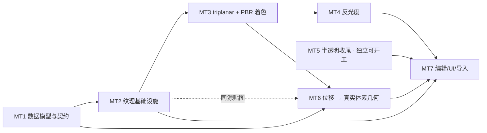

# GATE 材质系统与 PBR · 全局计划

## 0. 目标

把 gate 的材质从「per-material 纯色 + 三个标量」升级到
[Douglas #22](douglas/transcripts/Grass,%20textures,%20and%20a%20new%20codebase%20%5BVoxel%20Devlog%20%2322%5D%20%5BYTZBFz3Et40%5D.en.txt) 的模型：

```
voxel（材质标签） → 材质表（palette 槽） → 材质资产（PBR 贴图集）
                                          ↓ 上传/编辑时 bake
                                     逐体素法线 + 纹理参数（缓存）
```

**本次覆盖的四项**

| 项 | 现状 | 本计划中的位置 |
|---|---|---|
| 自发光 | ✅ 已完成 | 并入 MT3 的统一着色模型 |
| 半透明（吸收式透明） | 🟡 主 pass 有，GI 侧不参与 | MT5 |
| 反光度（镜面反射） | ❌ 未开始 | MT4 |
| PBR 材质（贴图集 + BRDF + **位移几何**） | ❌ 未开始 | MT1 / MT2 / MT3 / MT6 |

**非目标**（Douglas #22 的另一半，另立计划）

- 草/叶 decorations（aux buffer + 光栅化合成）
- volumetrics（光轴）
- 显式 per-voxel 法线**存储**（Douglas 已改隐式，gate 现状一致，不回退）
- **法线贴图造假凹凸**：凹凸改走 MT6 的**真实体素几何**（见 D2）

---

## 1. 现状取证

### 1.1 对照 Douglas #22

| Douglas #22 | gate 现状 | 证据 |
|---|---|---|
| 体素只存材质标签 | ✅ 16-bit palette index，65536 槽 | `PALETTE_BITS = 16`（[palette.rs](../gate-voxel/src/palette.rs)） |
| 材质参数在表里 | ✅ `color / roughness / emissive / transmission / flags` 8B | [palette.rs#L95-L111](../gate-voxel/src/palette.rs#L95-L111) |
| per-voxel 法线**隐式** | ✅ 运行时算，不存储 | `voxel_normal`（[world.wesl](../assets/shaders/voxel_raytrace/world.wesl)） |
| 上传时 bake + 缓存 | ❌ 无 bake pass、无缓存；法线每像素重算 —— **本计划决定不做**（凹凸改走真实几何，见 D2） | [main.wesl#L249-L261](../assets/shaders/voxel_raytrace/main.wesl#L249-L261) |
| 纹理 + triplanar mapping | ❌ 完全没有纹理，只有 per-material 纯色 | [common.wesl `palette_albedo`](../assets/shaders/voxel_raytrace/common.wesl#L74-L82) |
| **CSG 表面位移**（bumpy bricks） | ❌ `fill_box` / `fill_bricks` / `fill_sphere` 均无位移参数 | [gate-voxel/src/scene.rs](../gate-voxel/src/scene.rs) |
| PBR 贴图集（albedo / **height** / rough-metal） | ❌ | 无 `assets/textures/` 目录 |
| 吸收式透明 | 🟡 `transmission` + `MediumRay` 乘性 tint；但 GI 侧把 transmissive 像素整格判废 | [trace.wesl#L32-L50](../assets/shaders/voxel_raytrace/trace.wesl#L32-L50)、[screen.wesl#L231](../assets/shaders/voxel_raytrace/gi/screen.wesl#L231) |
| 自发光 | ✅ | [gi/ray.wesl#L82](../assets/shaders/voxel_raytrace/gi/ray.wesl#L82) |

### 1.2 关键结论

**"三种属性互斥 / 共用字段 + 标志位" 这个前提不成立，且不需要。**

- 物理上它们是 BSDF 的**独立参数**，不是互斥的材质类型：玻璃 = transmission + 光滑，磨砂玻璃 = transmission + 粗糙，LED 外壳 = emissive + transmission，金属 = metallic + 粗糙。
- 代码现状**已经是独立字段并存**：`PaletteEntry` 里三个属性各占一个字节，shader 侧各自独立解包、独立作用，且玻璃状态机本身就在同时使用 transmission 与（硬编码的）Fresnel 反射。
- 互斥枚举无法表达 metallic-roughness 的连续参数空间 ⇒ **它才是与 PBR 冲突的那一方**。
- 因此本计划**不为"互斥"做任何数据模型改动**。

**代码现状里唯一"互斥"的是着色分派**（`transmission > 0` → 玻璃状态机，否则 → 不透明着色），这是**读同一组参数后选代码路径**，与参数是否互斥无关，可以保留。

---

## 2. 硬约束（改动前必读）

1. **跨语言常量的权威在 WESL 源码**：`gate-render/src/wesl_consts.rs` 启动时解析 WESL 包的常量，Rust 侧不留副本，不一致即 fail-fast。新增材质常量必须写进 `.wesl`。
2. **GI 复用判据不可绕过**：ReSTIR 的样本等价 = **精确几何面键 + 二次顶点键逐位相等**（[gi/consts.wesl 文件头](../assets/shaders/voxel_raytrace/gi/consts.wesl#L18-L27)）。这是薄板/墙缝不漏光的根本。新特性（尤其 MT4 的粗糙反射）不得让不同方向的样本被判定为"等价"。
3. **着色口径不分叉**：`main.wesl` 的不透明分支与 `gi/ray.wesl` 的二次顶点辐亮度必须**逐项对齐**（含 1/π）。改一处必须同改另一处。
4. **bind group 必须从索引 0 起成前缀设置**（[README §5.6](../README.md)）。
5. **上传走增量**：`DirtyRanges { struct_ranges, palette_range }`（[builder.rs#L73-L79](../gate-render/src/brickmap/builder.rs#L73-L79)）。新增 GPU 资源必须有自己的增量路径，或写明"只能全量"的理由与代价。
6. **palette 布局改动三处同步**：`wire.rs::pack_palette_entry`（写） / `common.wesl` 三个解包函数（读） / `trace.wesl::medium_of`（介质读）；新增 `flags` 语义位时还要加上写入侧维护（见 MT1-2）。
7. **`PaletteEntry` 8B 按变体复用**（D1）：`flags` 的 bit4..7 是空闲位，`IS_PBR`（bit4）与 `TRANSMISSIVE`（bit5）占用后只剩 bit6..7；新增语义位前须复核。
8. **`gate-voxel` 零渲染依赖**（依赖仅 glam + rayon）：MT6 的位移高度场必须是**普通 CPU 数据**，不能把 GPU 纹理 / 渲染类型带进纯逻辑 crate。
9. **F0 只有一个来源**（D1「F0 的唯一来源规则」）：`IOR`（资产级，物理基值）+ `specular 覆盖`（槽级，仅调制）—— 不得再出现第三处 F0 编码（现存 `GLASS_IOR` / `GLASS_F0` 两份硬编码须随之删除）。

---

## 3. 关键设计决策（开工前需签字）

### D1 · palette 槽与材质资产：**8B 变体复用（tagged union）** —— 已定稿

**核心洞察（2026-09-20，用户提出）**：`PaletteEntry` 现有的 `color / roughness / emissive / transmission`
**本来就是 PBR 参数的子集**（PBR = albedo + roughness + metalness + emissive + transmission + IOR + …），
两者是**重叠**关系、不是并列关系。所以不需要扩字段，而是让这 8B **按 flag 复用为两种变体**：

| | `IS_PBR = 0` · **平凡材质** | `IS_PBR = 1` · **PBR 材质** |
|---|---|---|
| 语义 | 现在这套：逐 volume 独立参数 | 引用全局材质资产（PBR 贴图集）+ 标量覆盖 |
| payload | `color[3]` + `roughness` + `emissive` + `transmission` + `metallic` | `asset: u16`（65536 个资产）+ 4 个标量覆盖 |
| 共享头 | `flags`（两变体都有） | 同左 |

#### 属性清单的去留（回答 PBR 属性表）

| 属性 | 进 palette？ | 结论 |
|---|---|---|
| 颜色 albedo | ✅ 3B | 平凡变体的 `color`；PBR 变体由资产提供（不做逐实例染色） |
| 透明 transmission | ✅ 1B | |
| 粗糙 roughness | ✅ 1B | |
| 发光 emissive | ✅ 1B | |
| **金属度 metallic** | ✅ 1B | 落在**一直没用的 `_pad` 字节**上；默认 0 = 非金属 = 现状观感 ⇒ 零回归。**保持 8 bit、不切 1 bit** —— 手工调参下 metallic 确实几乎总是 0/1，但在**贴图驱动**下（D3 = B）它来自 rough-metal 贴图的 B 通道，是 **8 bit 连续量**（磨损边缘 / 锈迹 / 脏污的过渡）；palette 这 1B 是"无贴图时的回退值"，8 bit 是 glTF/UE 的标准做法 |
| **高光度 specular** | ✅ 1B（仅 PBR 变体） | **不新增字节、不切 metallic**：对非金属 `F0 = ((IOR−1)/(IOR+1))²` —— **"高光度"与"折射率"是同一物理量的两种编码**（IOR 1.5 → F0 0.04，正是"默认 0.5 ≈ 4%"；IOR 1.33 水 → 0.02；IOR 2.4 钻石 → 0.17）。gate 现在已有两份硬编码描述同一件事：`GLASS_IOR = 1.5` 与 `GLASS_F0 = 0.04`（[main.wesl#L41-L44](../assets/shaders/voxel_raytrace/main.wesl#L41-L44)）。**定稿方案**：① **IOR 提升为材质资产参数**（同时服务玻璃折射与电介质 F0，顺手消掉那两份硬编码）；② 逐槽调节走 **PBR 变体空着的 1B**（word1 bit24..31）作 `specular 覆盖`，语义同 glTF `KHR_materials_specular`（只调制电介质 F0，**对金属无效**）⇒ 资产级给物理基值、槽级给调节量，两者不重复 |
| **法线 normal** | ❌ 不存 | 法线是**几何的函数、不是材质的输入**：MT6 位移产出真实体素后，`voxel_normal` 从邻域梯度隐式给出（现状已如此，Douglas 亦为隐式）。⇒ palette 不存，**资产里也不要 normal 层** |
| **高度 height** | ❌ 不进 palette | 高度是**位移的输入**，只在体素化那一刻被采样一次；位移产物就是普通体素 ⇒ 只存在于**材质资产**（MT6 的输入），不进 palette、不进体素数据 |
| **AO** | ❌ 不需要 | 标准 PBR 的 AO 是 **AO 贴图**（材质表面的**微观**遮挡）；gate 已有的 `light_field_ao` 是**场景尺度**遮蔽，两回事。但在"凹凸 = 真实体素几何"的前提下，**凹槽真是凹的，GI 会自然把里面照暗**（Douglas 截图里凹槽发暗正是这个机制）；比一个体素更细的"微观遮挡"在体素引擎里无几何意义 ⇒ 不存 AO、不要 AO 贴图，省下的字节正好给 metallic |

⇒ 属性表里 8 项，实际进 palette 的是 **6 项**（color 3B + transmission + roughness + emissive + metallic = **7B**）+ `flags` 1B = **8B，正好填满**。

#### 字节布局（定稿）

**平凡变体 `IS_PBR = 0`（= 现状 + metallic，逐位向后兼容）**

| word | bits | 内容 |
|---|---|---|
| word0 | 0..23 | `color.r/g/b`（sRGB，各 8 bit） |
| word0 | 24..31 | `roughness` |
| word1 | 0..7 | `emissive` |
| word1 | 8..15 | `transmission` |
| word1 | 16..23 | `flags` |
| word1 | 24..31 | **`metallic`**（原 `_pad`，由"废弃"变为"有语义"） |

**PBR 变体 `IS_PBR = 1`（资产引用 + 标量覆盖）**

| word | bits | 内容 |
|---|---|---|
| word0 | 0..7 | `roughness` 覆盖 |
| word0 | 8..15 | `metallic` 覆盖 |
| word0 | 16..23 | `emissive` 覆盖 |
| word0 | 24..31 | `transmission` 覆盖 |
| word1 | 0..15 | **`asset: u16`** |
| word1 | 16..23 | `flags` |
| word1 | 24..31 | **`specular` 覆盖**（语义同 glTF `KHR_materials_specular`） |

- **覆盖语义**：`0 = 不覆盖（用资产的值）`，`1..255 = 覆盖为 (v−1)/254`（这样 `1` 能表达 roughness = 0 的完全镜面）。
- 相比最初提的"asset + rough/emit/trans 三个覆盖"，这里补上了 `metallic` 覆盖（word0 那 4 个字节本来就全空），
  且 `word1 bit24..31` 由"保留"改为 **`specular` 覆盖** ⇒ PBR 变体 7B payload 全部用满。
- **布局原则**：平凡变体的字节位置被"向后兼容"钉死、一格不能动；**PBR 变体的位置完全自由**（故按最省的方式排）。

#### **F0 的唯一来源规则**（消歧，防止出现第三份编码）

| 情形 | 规则 |
|---|---|
| 金属（`metallic = 1`） | `F0 = albedo`（绝缘体无漫反射，base color 即镜面色） |
| 非金属（`metallic = 0`） | `F0 = ((IOR−1)/(IOR+1))²`，`IOR` 来自**材质资产**；平凡变体固定 IOR = 1.5（⇒ F0 = 0.04 = **现状**） |
| 逐槽调节 | `specular 覆盖` 仅**调制**电介质 F0（乘性），**对金属无效** |
| 过渡（`metallic ∈ (0,1)`） | 两条 F0 按 metallic 线性混合（与 BRDF 的 metallic 混合同一个权重） |

⇒ `IOR` 是**物理基值**（资产级，同时服务玻璃折射与 F0）；`specular 覆盖` 是**逐实例调节**（槽级）。
两者职责不同、**不重复**。`GLASS_IOR` / `GLASS_F0` 两份硬编码随之删除（改为读资产 IOR + 上式导出）。

#### `flags` 位分配

| bit | 语义 |
|---|---|
| 0..3 | `LOCKED` / `INPUT_PORT` / `OUTPUT_PORT` / `HOLOGRAM`（现有，不动） |
| 4 | **`IS_PBR`**（变体位） |
| 5 | **`TRANSMISSIVE`**（DDA 热路径位，写入侧维护） |
| 6..7 | 保留 |

**为什么优于「扩到 16B」与「三属性互斥」**：

1. **向后兼容到零回归**：`IS_PBR` 只占 `flags` 的 **bit4**（当前空闲），平凡变体的字节布局与今天**逐位相同**
   ⇒ 现有解包函数、`medium_of`、UI 三个滑杆、`.vox` 导入**全部不用改**。
2. **不需要压精度**：平凡变体保留 8 bit 的 roughness / emissive / transmission。
3. **不需要三属性互斥**：平凡材质里三者照旧并存；互斥会丢掉的表达力（岩浆岩 = 粗糙岩石 + 裂缝发光）
   改由 PBR 变体承担（emission 贴图与 rough-metal 贴图并存）。
4. **资产上限 65536**，远超实际需要。

**必须遵守的三条（否则方案失效）**：

1. **着色公式唯一**：flag 只决定「参数从哪来」，**不决定走哪条着色路径**。全局只能有**一个** PBR BRDF 求值函数，
   平凡材质 = 「参数内联」的 PBR 材质（metallic 取 0、无贴图）。做成两条着色路径即违反硬约束 3。
2. **DDA 热路径必须只看 flags 位**：`medium_of`（[trace.wesl](../assets/shaders/voxel_raytrace/trace.wesl#L32-L39)）
   在 DDA 内**逐体素**调用；PBR 变体里 `transmission` 所在字节已被 `asset` 占用 ⇒ 透射判定改读
   `flags` 的 **`TRANSMISSIVE` 位（bit5；同一个 word1，零额外读取）**，该位由**写入侧**
   （`wire.rs::pack_palette_entry`）维护：平凡变体 = `transmission > 0`，PBR 变体 = 资产标了透射。
3. **flags 新位三处同步**：`wire.rs` / shader 解包 / UI 写入。

**已知代价**：

- 命中后着色多一级间接（palette → 全局资产表）；只发生在**命中点**、不是逐体素 ⇒ 可接受。
- `flags` 的 bit4/5/6 从「空闲」变为「有语义」，后续再加位需复核三者。

#### 核实取证（条目当前 8B，不是 16B）

| 事实 | 值 | 出处 |
|---|---|---|
| 材质索引位宽 | **16 bit**（不是字节） | `PALETTE_BITS = 16`（[palette.rs](../gate-voxel/src/palette.rs#L12)） |
| 体素数据宽度 | **16 bit/voxel**（叶层 `LEAF_VOXELS_PER_WORD = 2`） | [README §4](../README.md) |
| **palette 条目** | **8 B** | `PALETTE_BYTES_PER_ENTRY = 8`（[wire.rs#L30](../gate-render/src/brickmap/wire.rs#L30)） |
| 整表体积 | 65536 × 8B = **512 KB / volume** | `PALETTE_WORDS = 2^16 × 2 = 131072`（[wire.rs#L24](../gate-render/src/brickmap/wire.rs#L24)） |
| 字段占用 | word0 = `color[3]` + `roughness`；word1 = `emissive` + `transmission` + `flags`(bit16..23) + `pad`(bit24..31) | [palette.rs#L97-L111](../gate-voxel/src/palette.rs#L97-L111) |
| `flags` 空闲位 | **bit4..7**（现有 LOCKED/INPUT_PORT/OUTPUT_PORT/HOLOGRAM 占 bit0..3） | [palette.rs#L117-L121](../gate-voxel/src/palette.rs#L117-L121) |

⇒ "16" 在工程里出现两处，**两处都是 bit**（材质索引 16 bit、体素数据 16 bit/voxel）；
**palette 条目当前是 8B，代码里不存在 16B 的材质条目**。本方案的 `IS_PBR` 复用 `flags` 空闲位，故**无需改动宽度**。

### D2 · 凹凸的来源：真实体素几何（位移），不是法线 bake、也不是法线贴图

**用户决策（2026-09-20）**：不 bake 法线；**按 PBR 材质的高度/位移图生成真实的 voxel 几何**。

Douglas #22 原文：

> "I also on the CSG side added the ability to displace um the surfaces of like the Spheres and cylinders and whatnot that get drawn into volumes so it's possible to create bricks like this where the surface of the um voxal volume is actually bumpy and you also have the nice brick texture"

对齐截图（凹凸石块）的四条要点：

1. **位移发生在 CSG 体素化阶段**（draw 时），产出的是**真实体素几何** —— 凹凸处是真的一格一格错开的体素，能被 DDA 命中、能投影阴影、能被 GI 正确遮蔽。
2. **不需要 bake per-voxel 法线**：位移后的几何自身就带正确的凹凸，着色法线仍由既有 `voxel_normal` 从邻域**隐式**得出（与 gate 现状一致，不回退）。
3. **不需要法线贴图造假凹凸**：`MaterialAsset` 需要的是 **height / displacement 层**（供体素化采样），而不是 normal 层（供着色混合）。
4. **位移是一次性产物**：生成后就是普通体素，之后的编辑笔触与它互不干扰（与 Douglas 的 "draw 时位移" 语义一致，不引入"位移与编辑打架"的状态）。

**gate 的落点**：`gate-voxel/src/scene.rs` 的 CSG 帮助函数
（[fill_box / fill_bricks / fill_sphere / draw_text](../gate-voxel/src/scene.rs)）就是 Douglas 说的 "CSG side"，位移加在这里。

**关键约束**：`gate-voxel` 是纯逻辑 crate（依赖仅 glam + rayon，零渲染依赖）⇒
位移的输入必须是 **CPU 可读的高度场**，由 `gate-app` 从贴图解码后作为普通数据传入，
**不能**直接把 GPU 侧纹理类型带进去。

### D3 · 贴图形态：**2D triplanar（Douglas 路线）** —— 已定稿

**决策（2026-09-20）**：**复刻 Douglas 路线，用 2D 贴图集 + triplanar mapping。**

**关键结论：Palette 设计对形态无关** —— 条目只存 `asset: u16` + 标量覆盖，
贴图怎么采样完全在**资产与 shader** 侧 ⇒ 本决策只影响 MT2 / MT3。

**落点**：`assets/textures/pbr/` 放标准 PBR 贴图集（albedo / height / rough-metal），
GPU 侧 `texture_2d_array` + triplanar 三轴投影混合（按 `|n|` 加权）。
**收益：可以直接复用现成的 2D PBR 贴图包**（当初选 Douglas 路线的主要理由）。

| 被否决的备选 | 否决理由 |
|---|---|
| 3D 循环 volume | 显存 ×8；**用不了现成 2D PBR 贴图包**；且 **WGSL/WebGPU 没有 3D 纹理数组**（只有 `texture_2d_array`），多材质要 `binding_array<texture_3d>`（需开 wgpu 特性）或 z 切片摊平 + 手工三线性（每样本 8 次 load） |
| A + B 并存 | 两套采样路径 + 两套资产格式要维护，收益不足以抵消 |

**已知代价**（triplanar 固有）：斜面有过渡带与"贴片感"；斜切面处图案不贯穿（3D volume 才有的性质）。
**缓解**：MT3-1 的混合权重锐度可调（WESL 常量），必要时只在主轴附近取样（`pow(|n|, k)` 提升锐度）。

---

## 4. Milestone + Sub-task



> **独立性结论**：**MT5 可完全独立开工**（只碰 GI 链，与纹理无关）；**MT4 依赖 MT3 的 BRDF**；
> **MT6 的位移逻辑只依赖 MT1（资产布局）与 CPU 侧高度场**，可先于 MT3 落地，只有最后一步"位移产物在贴图着色下的观感验证"需要 MT3 就绪；
> MT1→MT2→MT3 是主干，必须串行。

---

### MT1 · 材质资产数据模型与跨语言契约

**状态：已完成（2026-09-20）** —— 见 `§8 实施记录`。人工回归（`cargo run -p gate-app` 画面无差异）待确认。

**验收标准**：palette 布局定稿并三处同步；画面与改动前逐位一致（资产索引恒 0 = 纯色材质回退）；`cargo clippy --workspace --all-targets -- -D warnings` 零警告。

| ID | sub-task | 验收标准 | 优先级 | 依赖 |
|---|---|---|---|---|
| MT1-1 | 定义 `MaterialAsset` 结构与字节布局：**通道 → 2D 贴图集槽位的映射**（albedo / **height（位移）** / rough-metal / emissive / transmission）+ 各通道的**标量回退值** + **IOR**（同时服务玻璃折射与电介质 F0，见 D1「F0 的唯一来源规则」）+ 位移幅度，写进 `wire.rs` 并加编译期尺寸断言 | 结构有 `#[repr(C)]` + size 断言；文档注释写明每字段语义与槽 0 = "无贴图"；**height 层单独列出**（供 MT6 的 CSG 位移采样，不参与着色混合）；**无 normal 层**（法线隐式，见 D1 属性清单） | P0 | — |
| MT1-2 | 按 **D1（8B 变体复用）** 落地：`flags` 新增 `IS_PBR`(bit4) / `TRANSMISSIVE`(bit5) 两位语义；PBR 变体 payload = `asset: u16` + 5 个覆盖（roughness / metallic / emissive / transmission / **specular**）；`wire.rs::pack_palette_entry` **负责维护两位**（平凡 = `transmission > 0`） | 平凡变体的 8B 与改动前**逐位相同**（仅 `_pad` 变为 `metallic`，默认 0）；`medium_of` 改为读 `TRANSMISSIVE` 位后，介质行为与改动前逐位一致；三处布局注释同步 | P0 | MT1-1 |
| MT1-3 | 新增材质常量进 WESL（`MATERIAL_*`：资产表条目字数、贴图槽数上限、纹理采样的世界尺度），由 `wesl_consts.rs` 解析 | 启动日志打印解析出的常量；故意改坏一行 WESL 常量 → 启动 fail-fast 报错 | P0 | MT1-1 |
| MT1-4 | 回归验证：改动前的场景（nuke.vox）画面与改动后一致（所有材质暂为平凡变体） | 手工比对无可见差异；`UPLOAD[incremental]` 字节数与改动前相同 | P0 | MT1-2 |

---

### MT2 · 纹理基础设施

**MT2-1 / MT2-1c / MT2-2 状态：已完成（2026-09-20）** —— 见 `§8 实施记录`。**MT2-1b、MT2-3 未完成**（MT2-1b 只差"按引用加载"，属 MT7）。

**验收标准**：一张调试贴图能按 **triplanar** 出现在命中面上（先不做 BRDF）；资产表上传有日志可查。

| ID | sub-task | 验收标准 | 优先级 | 依赖 |
|---|---|---|---|---|
| MT2-1 | 新建 `assets/textures/pbr/` 目录 + 加载路径：`AssetServer` 加载 → `GpuImage` → 转 `texture_2d_array`（**GPU 侧只需 2 组：albedo / rough-metal**；统一尺寸/格式 + mipmap）。**height 不进 GPU** —— 它只在 MT6 的 CSG 位移时被 CPU 采样一次（位移后即普通体素）。emissive / transmission 贴图为可选组，缺省走标量回退值 | 启动日志打印已加载的层数与尺寸；缺贴图时回落为纯色，不 panic；**只加载场景实际引用的材质**（不做全量预载） | P0 | MT1 |
| MT2-1b | **（已完成 2026-09-20）** 贴图集来源与分辨率策略：**Poly Haven**（CC0，免费 API 无需 key）+ 仓内脚本 `fetch_pbr_textures.py` 批量拉取。材质集 = **16 个 @1k**，落 `assets/textures/pbr/<id>/`，共 **43.3 MB**（48 文件）。**其中 `metal_plate` 是唯一的金属**（验收 metallic / roughness BRDF 与镜面反射靠它）。已核实：重跑全部 md5 命中跳过（幂等）；无 `.part` 残留 | 有明确的显存估算记录；30 材质时 GPU 占用 ≤ 100MB | P1 | MT2-1 |
| MT2-1c | **（① 已完成 2026-09-20；② 按触发条件推迟）** 显存预算处置：① **通道打包**（`albedo.rgb + roughness.a` → 一层 `Rgba8Unorm` 4MiB；metalness → `R8Unorm` 1MiB）⇒ **8MiB → 5MiB/材质**，实测 16 材质 **128 → 80 MiB**；加 `GPU_TEX_SIZE` 常量（默认 1024，设 512 再降 4×）。② **BC7/BC4 压缩**（约 1.2MiB/材质）**未做** —— 需要离线 KTX2 工具链或新编码器依赖，触发条件 = 材质数逼近 30（1024 打包后 ≈ 150MiB > 100MB 预算）；届时优先试 `GPU_TEX_SIZE = 512`（≈ 38MiB，texel 密度仍够、零依赖） | ① 16 材质实测 80MiB ✅；② 推迟（触发条件已写明） | P0 | MT2-1 |
| MT2-2 | **（已完成 2026-09-20）** 材质资产表的 CPU 构建 + GPU 上传 + 绑定到 `@group(1)`：`bindings.wesl` 新增 `@binding(6) material_assets` / `(7) pbr_albedo_rough` / `(8) pbr_metal`（复用 `(5) light_samp`）+ 镜像 `struct MaterialAsset`；**全局一张表** 1024 × 32B = 32KB，一次全量上传；BG1 只有一份 layout（beam/gi/dda 共用），占位 1×1×1 数组 + 零初始化资产表 ⇒ 资源缺失不 panic | ✅ 资源在 prepare 里可见（有日志）；启动无 wgpu validation error；占位路径实测不 panic | P0 | MT1 |
| MT2-3 | 采样器与 mip 策略（Linear + mipmap + anisotropy 上限），复用现有 `light_samp` 或另建 | 远处贴图无摩尔纹闪烁；近处无过度模糊 | P1 | MT2-1 |
| MT2-4 | 调试开关：用一次 flat 采样把贴图色替换 albedo 直出 | 菜单开关（或 shader 常量）打开后，命中面显示贴图而非纯色 | P0 | MT2-2 |

> **风险点**：`@group(1)` 被 beam / gi / dda 三个 pass 共用，新增 binding 要同时更新三处 bind group layout（见 `dda.rs` / `gi.rs` 的 layout 定义）。

---

### MT3 · triplanar 采样 + PBR 着色模型

**验收标准**：metallic-roughness 着色生效；GI 画面与直射画面口径一致（同一材质在阴影区与直射区无色彩突变）；README §7 手工验收全过。

| ID | sub-task | 验收标准 | 优先级 | 依赖 |
|---|---|---|---|---|
| MT3-1 | **triplanar 采样**（D3 = B）：按 `\|n\|` 三轴投影加权混合，用命中点 world position 采样 `texture_2d_array`；混合锐度用 WESL 常量（`pow(\|n\|, k)`） | 贴图在体素面上无接缝/拉伸；体素边缘无可见跳变；斜面过渡带在锐度调到高档后不可见 | P0 | MT2 |
| MT3-2 | **纹理取值接口** `fetch_material(pos, n) -> MaterialParams{albedo, roughness, metallic, emissive, transmission, ior, specular}`：平凡材质走"参数内联"分支、PBR 材质走 triplanar 采样 | 着色侧只见这一个入口（D1 约束 1）；平凡变体画面与 MT1-4 一致 | P0 | MT3-1 |
| MT3-3 | metallic-roughness BRDF 求值，替换 `main.wesl` 的 `col = alb*(...) + spec + emissive` 表达式；F0 按 D1「F0 的唯一来源规则」导出（金属 = albedo，非金属 = `((IOR−1)/(IOR+1))²`，`specular 覆盖` 只调制电介质 F0） | 金属/粗糙度参数变化有正确的观感走向（金属变暗漫反射 + 有色高光；粗糙度控制高光宽度）；`metallic ∈ (0,1)` 的过渡无跳变 | P0 | MT3-2 |
| MT3-4 | `gi/ray.wesl` 的二次顶点着色口径同步（硬约束 3） | 逐项对照注释确认；阴影区与直射区同一材质无色彩/亮度跳变 | P0 | MT3-3 |
| MT3-5 | **口径确认**：着色法线只来自 `voxel_normal`（隐式、由真实几何决定），**不引入法线贴图混合** —— 凹凸统一由 MT6 的真实体素几何提供 | 代码中不存在 normal map 混合项；凹凸观感全部来自几何；同材质在凹凸面上的法线走向与几何一致 | P0 | MT3-3 |
| MT3-6 | 自发光并入统一着色模型（不改变现有观感） | 自发光亮度与改动前一致（同一 `emissive` 值下画面无变化） | P1 | MT3-3 |
| MT3-7 | **变体统一**（D1 约束 1）：平凡材质与 PBR 材质共用**同一个** BRDF 求值函数 —— 平凡 = 参数内联（metallic 取 0、无贴图）；**不允许出现两条着色代码路径** | 代码中只有一个 BRDF 求值入口；平凡变体画面与 MT1-4 一致 | P0 | MT3-3 |
| MT3-8 | 删除 `GLASS_IOR` / `GLASS_F0` 两份硬编码（[main.wesl#L41-L44](../assets/shaders/voxel_raytrace/main.wesl#L41-L44)），改为**读资产 IOR + F0 公式导出**（硬约束 9） | 玻璃折射与观感与改动前一致（IOR = 1.5 时逐位相同）；代码中 F0 只剩一个来源 | P0 | MT3-3 |

---

### MT4 · 反光度（镜面反射）

**验收标准**：光滑金属块能看到环境/场景反射；开/关反射对 GI 无影响（GI 复用判据不被破坏）。

| ID | sub-task | 验收标准 | 优先级 | 依赖 |
|---|---|---|---|---|
| MT4-1 | 主 pass 反射射线：`roughness` 低到阈值时追加一条反射射线；近似辐亮度复用 `trace_glass` 的现成做法 | 镜面球可见环境反射；关掉开关画面回到 MT3 状态 | P0 | MT3 |
| MT4-2 | 明确边界：反射样本**不进 ReSTIR**（避免破坏"键逐位相等"判据），并写进代码注释 | 注释写明理由；开反射后 GI 画面与 MT3 一致（无渗色/闪烁回归） | P0 | MT4-1 |
| MT4-3 | 粗糙反射的采样策略（GGX 重要性采样或高光近似），与 MT3 的 BRDF 高光项去重 | 无"高光算两遍"导致的能量翻倍（对比粗糙度扫描的亮度单调性） | P1 | MT4-1 |
| MT4-4 | 性能量化：反射射线对帧时的影响 | profile 构建下 `gate_dda_trace` 的 GPU 时间增量有记录 | P1 | MT4-1 |

---

### MT5 · 半透明收尾（吸收式透明）· **可独立开工**

**MT5-0 状态：已完成（2026-09-20）** —— 见 `§8 实施记录`；MT1 的交接项已关闭。**MT5-1 ~ MT5-4 未开始**（MT5-1 的前置条件已满足）。

**验收标准**：玻璃既**被 GI 照明**、也**产生 GI**；有色玻璃呈现吸收色而非纯乘性暗化。

| ID | sub-task | 验收标准 | 优先级 | 依赖 |
|---|---|---|---|---|
| **MT5-0** | **（已完成 2026-09-20）**~~（MT1 的交接项，必须先做）~~ 把三处仍在按**字节**读透射率的调用点改成读 `palette_flags(...) & FLAGS_TRANSMISSIVE`：`main.wesl` 的玻璃状态机入口、`trace_glass` 循环内的界面判定、`gi/screen.wesl` 的介质像素整格判废（第三处布尔语义取反，别写反）。PBR 变体下 `transmission` 所在字节属于 `asset`，按字节读会**误读成随机透射率** | ✅ 三处都走标志位；`palette_transmission` 因无调用点已删除；平凡材质逐位不变（写侧 `transmission > 0 ⟺ 位为 1`）；启动无 WARN/ERROR | P0 | — |
| MT5-1 | 让 transmissive 表面参与 GI：改 `gi/screen.wesl` 的整格判废逻辑 | glass 表面像素的导引「键非零」；GI 有值；无漏光回归 | P0 | — |
| MT5-2 | `gi/ray.wesl` 的二次射线支持介质续行（现在用 `world_raycast`，只停不透明） | 玻璃后的二次顶点能被照到 | P0 | MT5-1 |
| MT5-3 | Beer-Lambert 吸收色：`medium_of` 的 `srgb²` 近似换成可调吸收系数（per-material） | 厚玻璃比薄玻璃更暗；彩色玻璃出正确的吸收色 | P1 | — |
| MT5-4 | 回归：薄板/墙缝不漏光（硬约束 2） | 玻璃薄板两侧 GI 不互相渗透 | P0 | MT5-1 |

> **注意**：MT5-1 会动到 GI 的有效性判据，必须与硬约束 2 一起验证（薄板不漏光是历史回归）。

---

### MT6 · 材质位移 → 真实体素几何

**验收标准**：按材质高度图位移出的石块呈现**真实体素凹凸**（对齐 Douglas #22 截图 —— 凹凸是一格一格错开的体素，不是着色出来的假凹凸）；位移后的几何能被 DDA 命中、能投影阴影、能被 GI 正确遮蔽。

| ID | sub-task | 验收标准 | 优先级 | 依赖 |
|---|---|---|---|---|
| MT6-1 | `MaterialAsset` 的高度/位移语义定稿（位移幅度、采样频率/缩放、是否各向异性、方向是外推还是内缩） | 语义写进 `wire.rs` 注释与 MT1-3 的 WESL 常量；改坏常量启动 fail-fast | P0 | MT1-1 |
| MT6-2 | CPU 侧高度场解码：贴图 → 普通 CPU 高度数组（`gate-app` 侧，**不进 `gate-voxel`**，见硬约束 8） | 日志可打印高度场尺寸与取值范围；与 MT2 共用 `assets/textures/pbr/` 同源贴图 | P0 | MT6-1 |
| MT6-3 | CSG 位移 API：`gate-voxel/src/scene.rs` 的 `fill_box` / `fill_sphere` / `fill_bricks` 增加位移参数（按高度场沿表面法线外推/内缩体素） | 构造脚本能产出凹凸石块；可打印写入体素数；纯逻辑 crate 仍零渲染依赖 | P0 | MT6-2 |
| MT6-4 | 渲染验证：位移产物的 DDA 命中、凹凸处的自遮蔽与投影、GI 遮蔽正确 | 对齐 Douglas #22 截图的凹凸观感；薄板不漏光无回归（硬约束 2） | P0 | MT6-3、MT3 |
| MT6-5 | 编辑语义定稿：位移是**一次性产物**，笔触覆盖即普通体素，不做"位移重算" | 编辑后不出现"位移残留/重算"状态；`EDIT[place\|erase]` 行为与普通体素一致 | P1 | MT6-3 |
| MT6-6 | 体量代价量化：位移后的体素数 / 树节点数 / 上传字节数 | `UPLOAD[full]` 字节数有记录；位移后的编辑 `UPLOAD[incremental]` 耗时仍在毫秒级 | P1 | MT6-3 |

---

### MT7 · 编辑 / UI / 导入收尾

**验收标准**：菜单可调材质并即时生效；`.vox` 导入的材质映射正确。

| ID | sub-task | 验收标准 | 优先级 | 依赖 |
|---|---|---|---|---|
| MT7-1 | `debug_menu.toml` 加 **metallic / IOR / specular** + 贴图集槽位选择 + `IS_PBR` 变体切换；i18n 文案（`assets/locales/zh-CN.yml`） | 菜单改动即时生效，日志有 `材质 → …` 一行；切到 PBR 变体后画面随之改变 | P0 | MT2 |
| MT7-2 | `.vox` 导入映射：`MATL` 的 rough/emit → 材质资产 | 导入模型材质观感正确 | P1 | MT3 |
| MT7-3 | 材质编辑走内容去重落 palette 槽（沿用现有路径） | 改材质不影响旧体素 | P1 | MT7-1 |

---

## 5. 风险

| # | 风险 | 影响 | 缓解 |
|---|---|---|---|
| R1 | 反射/粗糙镜面与 GI 的"键逐位相等"判据冲突 | 薄板漏光回归、视觉噪声 | MT4-2 明确边界：反射样本不进 ReSTIR；MT4-3 做能量去重 |
| R2 | `@group(1)` 新增 binding 需同步三个 pass 的 layout | 绑定不匹配 → 启动 panic 或画面异常 | MT2-2 把 layout 更新列为同一 sub-task 的验收项 |
| R3 | palette 布局改动遗漏三处同步之一 | 解包错位 → 颜色/介质全错（历史上有过 face 位与有效位撞车的同类事故） | MT1-2 三处同步 + MT1-4 逐位回归 |
| R4 | 纹理显存与 mipmap 生成开销 | 首帧卡顿、显存膨胀 | MT2-1 统一尺寸/格式；MT2-3 设 anisotropy 上限 |
| R5 | MT5 动 GI 有效性判据 | 薄板漏光回归 | MT5-4 专门验证 |
| R6 | 无自动化测试（README §59），回归全靠手工 | 隐性回归 | 每个 milestone 的验收标准都设计为**可手工观察**（日志或画面） |
| R7 | 位移让体素数膨胀（每个表面体素可能外推数格） | 树节点数/显存/上传字节数上涨，可能拖慢编辑与上传 | MT6-6 量化；位移幅度设上限；必要时限制位移只作用于"材质标记为可位移"的块 |
| R8 | 位移发生在 `gate-voxel`（纯逻辑 crate），高度场必须是 CPU 数据 | 若图省事把 GPU 纹理类型带进去，会破坏零渲染依赖约束 | 硬约束 8 + MT6-2 验收项 |
| R9 | 位移与 GI 面键的交互（新体素改变面归属） | 编辑/生成后 GI 需当场重建而非复用旧历史 | 面键判据本身是精确的 ⇒ 几何变化当场重建（已有机制，无需新增；MT6-4 验证） |

---

## 6. 质量门禁（每个 milestone 收尾必跑）

```powershell
cargo fmt --all -- --check
cargo clippy --release --workspace --all-targets -- -D warnings
cargo build --release --workspace
```

手工验收：`cargo run --release -p gate-app`，对照 [README §7](../README.md) 的验收清单 +
本计划各 milestone 的验收标准。

---

## 7. 决策记录

| 日期 | 决策 | 结论 | 依据 |
|---|---|---|---|
| 2026-09-20 | 材质属性是否互斥 | **不互斥**：三者是独立 BSDF 参数，保留现有独立字段 | 物理正确性 + PBR 需要连续参数空间；代码现状已独立 |
| 2026-09-20 | 数据模型路线 | **全量对齐 Douglas #22**：引入材质资产 + 纹理 | 用户决策 |
| 2026-09-20 | palette 与资产的衔接 | **定稿：8B 变体复用（tagged union）** —— 现有三属性本就是 PBR 的子集，故按 `flags::IS_PBR` 分派两种变体：平凡材质（现状逐位不变）/ PBR 材质（`asset: u16`） | 用户提出；不扩宽度、不压精度、不需要三属性互斥 |
| 2026-09-20 | 三属性是否互斥 | **不互斥**（最终结论）：互斥的动机是省空间，而变体复用已把空间问题解决；互斥会丢掉"粗糙 + 局部发光"这类标准 PBR 组合 | 见 D1 |
| 2026-09-20 | 凹凸的来源 | **按材质高度/位移图生成真实体素几何**（CSG 位移）；**不 bake 法线**、**不用法线贴图造假凹凸** | 用户决策；Douglas #22 原文 + 视频截图 |
| 2026-09-20 | 位移的落点 | `gate-voxel/src/scene.rs` 的 CSG 帮助函数；高度场以普通 CPU 数据传入 | `gate-voxel` 零渲染依赖（硬约束 8） |
| 2026-09-20 | metallic 放哪 | **占用一直没用的 `_pad` 字节**（word1 bit24..31）；默认 0 = 非金属 = 现状 ⇒ 零回归；**保持 8 bit**（贴图驱动下是连续量，8 bit 是 glTF/UE 标准），不切 1 bit | 属性清单 7B + flags 1B 正好填满 8B |
| 2026-09-20 | 高光度 specular 怎么放 | **定稿（方案甲）**：① **IOR 进材质资产**（同时服务玻璃折射与电介质 F0，删掉 `GLASS_IOR`/`GLASS_F0` 两份硬编码）；② `specular` 占 **PBR 变体空着的 word1 bit24..31** 作槽级覆盖（语义同 glTF `KHR_materials_specular`，只调制电介质 F0、对金属无效）；③ metallic 不降精度 | 用户决策；"高光度"与"IOR"是同一物理量的两种编码，必须定死 F0 的唯一来源规则（硬约束 9） |
| 2026-09-20 | 法线 / 高度是否入 palette | **都不入**：法线是几何的函数（隐式，永不存）；高度只是位移的输入，只存在于材质资产 | 见 D1 属性清单 |
| 2026-09-20 | 是否需要 AO 值 | **不需要**（palette 与资产都不存）：真实体素几何 + GI 已覆盖凹槽遮蔽，微观 AO 在体素粒度无意义 | 见 D1 属性清单 |
| 2026-09-20 | 贴图形态（3D 循环 volume vs 2D triplanar） | **定稿 B：2D 贴图集 + triplanar（复刻 Douglas 路线）** —— 可直接复用现成 PBR 贴图包；3D volume 与"A+B 并存"否决（显存 ×8 / 用不了现成贴图包 / WGSL 无 3D 纹理数组） | 用户决策；见 D3 |
| 2026-09-20 | 贴图集来源与分辨率 | **Poly Haven**（CC0，免费 API）经仓内脚本 `fetch_pbr_textures.py` 拉取；材质集 **16 个 @1k**（43.3 MB，含唯一的金属 `metal_plate`）。ambientCG 物量更大但无批量 API，留作补充；**3dtextures.me 是 Douglas 截图里用的站**（CC0，但免费档只到 1K、无独立 Metalness） | 用户决策 + 实测 |
| 2026-09-20 | 贴图分辨率档 | **1k**（Poly Haven 的最低档；无更低的）。依据 2cm 体素做 texel 密度核算：1k 铺 1~2.5m ⇒ 每体素面 10~20 texel，而 1080p 下 1~2m 视距时每体素面仅 5~11 屏幕像素 ⇒ 密度匹配且有余量。**一张贴图铺多少米是 MT3 的常量**（triplanar 走世界坐标，与体素尺寸解耦） | 用户判断 + 密度核算 |

---

## 8. 实施记录

### 2026-09-20 · MT1 + MT2-1（并行实施）

#### MT1 改了 5 个文件

| 文件 | 内容 |
|---|---|
| `gate-voxel/src/palette.rs` | `PaletteFlags` 新增 `IS_PBR`(bit4) / `TRANSMISSIVE`(bit5)；`_pad: u8` → `pub metallic: u8` |
| `gate-render/src/brickmap/wire.rs` | `pack_palette_entry` 加 `metallic<<24` 并维护 `TRANSMISSIVE`；新增 `MaterialAsset`(32B + 尺寸断言) / `MATERIAL_SLOT_NONE` / `PbrOverrides` / `pack_palette_entry_pbr` |
| `gate-render/src/wesl_consts.rs` | 新增**独立于 `GiConsts`** 的 `MaterialConsts`（自己的 `REQUIRED` + fail-fast + 启动打印） |
| `assets/shaders/voxel_raytrace/common.wesl` | 权威常量 `MATERIAL_ASSET_SLOTS = 1024` / `MATERIAL_TEX_SLOTS = 64`；`FLAGS_IS_PBR` / `FLAGS_TRANSMISSIVE` / `palette_flags()` |
| `assets/shaders/voxel_raytrace/trace.wesl` | `medium_of` 改读 `TRANSMISSIVE` 位（平凡变体分支与原来逐行等价） |

**逐位回归取证**（平凡条目 `[word0, word1]`）：

| 场景 | 改动前 | 改动后 | 差异 |
|---|---|---|---|
| 纯色不透明 | `[0x803264C8, 0x00010000]` | `[0x803264C8, 0x00010000]` | **无** |
| 玻璃 transmission=200 | `[0x001E140A, 0x0000C800]` | `[0x001E140A, 0x0020C800]` | 仅 **bit21**（`TRANSMISSIVE` 0→1） |
| 发光玻璃 transmission=7 | `[0x280080FF, 0x0008075A]` | `[0x280080FF, 0x0028075A]` | 仅 **bit21** |

⇒ `metallic` 默认 0 ⇒ 打包逐位不变；`TRANSMISSIVE` 位改动前空闲恒 0，且 `medium_of` 的"非介质"分支与旧式 `a = 1 − transmission/255 = 1.0` 等价（调用方只用 `a >= 1.0` 判不透明、不消费 rgb）。
已核实 `pack_palette_entry` **只有一个调用点**（`builder.rs:214`）⇒ 介质位不会漏维护。

**连带修复（必须记住的坑）**：`_pad` 由**私有**字段变为 `pub metallic` 后，clippy 的 `field_reassign_with_default` 在 `gate-app` 被激活（原先因结构体含私有字段而静默）⇒ workspace clippy 门禁变红。已把那 4 处（`edit.rs`、`scene.rs` ×2、`vox_scene.rs`）改成 FRU 结构体字面量形式，门禁恢复绿色。

**交接项**：仍有两处按**字节**读透射率 —— `main.wesl:226`（玻璃状态机入口）与 `gi/screen.wesl:231`（介质像素整格判废）。平凡材质行为不变，但 PBR 变体下那个字节属于 `asset` ⇒ 已登记为 **MT5-0（P0，必须先做）**。

#### MT2-1 产出

- 新增 `gate-render/src/pbr_texture.rs`：`PbrTextureSet`（有序 id 表 = 槽号 = 层号、`albedo` `texture_2d_array`/`Rgba8UnormSrgb`、`roughmetal` `texture_2d_array`/`Rgba8Unorm`、`ids()` / `slot_of()` / `bytes()` 等）+ `PbrTexturesPlugin`；`lib.rs` 注册。
- **启动日志实测**：`16 个材质 → albedo[1024×1024×16] ≈ 64.0MiB + roughmetal[1024×1024×16] ≈ 64.0MiB = 合计 ≈ 128.0MiB`；槽号 0..15 与目录名字典序一致；无 WARN / ERROR / panic。
- `height.png` **完全不加载**（MT6 的 CPU 侧位移输入，不进 GPU）。
- 新增依赖：`gate-render/Cargo.toml` 的 `bevy` 开 **`jpeg`** feature（workspace 的 bevy 是 `default-features = false` 且未开 jpeg ⇒ 否则 32 张 jpg 全部加载失败）。
- bevy 0.20 踩坑（两次都值得记）：① `texture_2d_array` 必须显式给 `TextureViewDescriptor { dimension: Some(D2Array) }`，否则视图是单层 D2、将来绑 `texture_2d_array` 会被 wgpu 拒；② 中间张要 `asset_usage = MAIN_WORLD`，否则 32 张单层图各自上 GPU、凭空多 ≈128MiB。
- **验收标准偏差**："只加载场景实际引用的材质" 当前是**空集**（palette 里尚无 `IS_PBR` 写入方）⇒ 本次全量加载 16 个并写进日志；按引用加载留到 MT2-2 / MT7。

#### 门禁与待办

- `cargo fmt --all -- --check` / `cargo clippy --workspace --all-targets -- -D warnings` / `cargo build --workspace` —— **三条全绿**。
- **待人工**：`cargo run -p gate-app` 画面与改动前无可见差异（尤其玻璃 / 发光玻璃的介质观感）。
- **新增待办**：`MT5-0`（见上）；`MT2-1c` 的显存处置现在有实测数字（128MiB @16 材质）。

### 2026-09-20 · MT5-0（关闭 MT1 的交接项）

3 处仍在按**字节**读透射率的调用点全部改读 `FLAGS_TRANSMISSIVE` 位：

| 文件 | 行 | 改动 |
|---|---|---|
| `main.wesl` | 82–87 | `trace_glass` 循环内 `let tau = palette_transmission(...); if (tau <= 0.0)`（`tau` 只当布尔用、不参与颜色）→ `if ((palette_flags(...) & FLAGS_TRANSMISSIVE) == 0u)` |
| `main.wesl` | 230–234 | 玻璃状态机入口 `palette_transmission(...) > 0.0` → `(palette_flags(...) & FLAGS_TRANSMISSIVE) != 0u` |
| `gi/screen.wesl` | 231–234 | 介质像素整格判废：布尔取反语义不变（「命中 && 非介质」才有效），判据换标志位 |
| `common.wesl` | — | **删除 `palette_transmission`**（删完全仓无调用点）；`main.wesl` / `gi/screen.wesl` / `trace.wesl` 的 import 一并清理 |

- **平凡材质逐位不变**：写侧 `pack_palette_entry` 保证 `transmission > 0 ⟺ TRANSMISSIVE = 1`，故 `tau <= 0.0 ⟺ 位为 0` 对平凡条目恒成立；PBR 变体不再按字节误判成介质/非介质。
- 门禁实测：`cargo fmt --all -- --check` / `cargo clippy --workspace --all-targets -- -D warnings` / `cargo build --workspace` 三条全绿；`cargo run -p gate-app` 启动正常（WESL 读盘编译无报错，`logs/latest.log` 无 ERROR/WARN）。
- **待人工**：玻璃观感（折射 / 反射 / 介质续行）只能上画面确认。

### 2026-09-20 · MT2-1c（通道打包降显存）

改 `gate-render/src/pbr_texture.rs` 一个文件。两张数组从"albedo 一张 + arm 原样一张"改成：

| 数组 | 格式 | 通道语义 | 单层 @1k |
|---|---|---|---|
| `albedo_rough()` | `Rgba8Unorm` | rgb = albedo（**sRGB 编码原始字节，CPU 侧不转换**）、a = roughness（arm 的 G） | 4 MiB |
| `metal()` | `R8Unorm` | r = metalness（arm 的 B） | 1 MiB |

- arm 的 R（AO）按 D1 丢弃（不需要 AO）。
- **为什么用 `Rgba8Unorm` 而不是 `Rgba8UnormSrgb`**：Unorm 采样零转换 ⇒ shader 拿到的 rgb 就是 sRGB 编码值，交给既有 `srgb_to_linear()`，与 `palette_albedo`（读字节 → 转 linear）**同一口径**；若用 Srgb 格式会变成"rgb 已解码、a 不解码"的隐式约定，有双重解码风险。**不在 CPU 侧转 linear**（8bit linear 暗部起色带）。
- API 改名：`albedo()` → `albedo_rough()`、`roughmetal()` → `metal()`（改名后工作区零调用方，故无连带改动）。
- 新增 `GPU_TEX_SIZE: u32 = 1024`（设 512 再降 4×，注释里写明 texel 密度依据与"与 MT3 的贴图世界尺度常量耦合"）。
- **实测：16 材质 128 MiB → 80 MiB**（64 + 16，5 MiB/材质）；临时切到 512 实测 `20 MiB`、盒式降采样路径无 WARN/panic，随后已恢复默认 1024。
- **BC7/BC4 压缩未做**：需要离线 KTX2 工具链或新编码器依赖（本次约束"零新依赖"），且 16 材质已在预算内。**触发条件 = 材质数逼近 30**（1024 打包后 ≈150MiB）；届时优先试 `GPU_TEX_SIZE = 512`，不够再上 BC7/BC4。结论已写进 `GPU_TEX_SIZE` 的文档注释与启动日志。

### 2026-09-20 · MT2-2（资产表上传 + 绑定 `@group(1)`）

| 文件 | 内容 |
|---|---|
| `bindings.wesl` | 新增 `@binding(6) material_assets`（storage array）/ `(7) pbr_albedo_rough` / `(8) pbr_metal`；新增与 Rust 逐字段镜像的 `struct MaterialAsset`（8×u32 = 32B）。**复用 `(5) light_samp`** 作采样器，0..5 未动 |
| `pbr_texture.rs` | 新增 `build_material_asset_table`（1024 × 32B = 32KB）；`PbrTextureSet` 加 `ExtractResource` 让 render world 可见 |
| `brickmap/upload.rs` | `init_empty_gpu` 建资产表 buffer（占位即最终尺寸，无需扩容）+ 两张 1×1×1 占位数组纹理；`prepare` 里一次**全量**上传并打日志 |
| `brickmap/dda.rs` | BG1 layout 追加 6/7/8；`prepare_dda_bind_groups` 绑上（缺资源回退占位视图） |
| `wire.rs` / `wesl_consts.rs` / `common.wesl` | 注释修正：资产表是**全局一张、所有 volume 共用**（原先误写"每 volume"） |

- **资产表内容**：全局一张，槽 `i < 16` → `albedo_slot = roughmetal_slot = i`、`emissive/transmission/height_slot = MATERIAL_SLOT_NONE`；其余槽位五个 `*_slot` 全 `MATERIAL_SLOT_NONE`（**不用 0** —— 0 是合法层号，会被误当成"指向第 0 层贴图"）。标量回退 = 默认电介质（中性灰 albedo + roughness 0.5 + metallic 0 + specular 0.5 中性 + IOR 1.50）。
- **一处临时 demo 默认值**：槽 10（`metal_plate`）的 `metallic = 255` —— MT3 验收 metallic/roughness BRDF 需要有个金属可用。用 `METAL_DEMO_ID` 常量 + 注释 + 启动日志三处明示"临时，真正编写属 MT7"。
- **增量路径未做**：本表是静态默认集、当前无写入方，一次全量即可；待 MT7 有材质编辑时再加（日志里已写明）。
- **BG1 只有一份 layout**（全仓 grep 确认）：beam / gi / dda 三个 pass 共用同一个 `bg1` 句柄 ⇒ 不存在"改了 layout 漏改副本"的风险。
- **占位路径实测不 panic**：临时把 `assets/textures/pbr` 改名后启动 —— 得到 2 条 WARN（扫描失败 / 无可用材质）+ 1 条 INFO（绑 1×1×1 占位），无 validation error，GI 降噪 pass 照常派发；随后文件名已还原（48 文件复核完好）。
- 门禁三条全绿；`cargo run -p gate-app` 启动无 validation error。

#### 待人工 / 遗留

- **待人工**：画面与改动前无可见差异（MT5-0 与本批都不动着色公式，PBR 采样路径 MT3 才接）。
- **`metal_plate` 的 metallic 默认值观感**要等 MT3 的 BRDF 才能看。
- **MT2-3 未做**（mip / anisotropy）：现在是 bevy 默认采样器参数（nearest + clamp），接 triplanar 前要处理。
